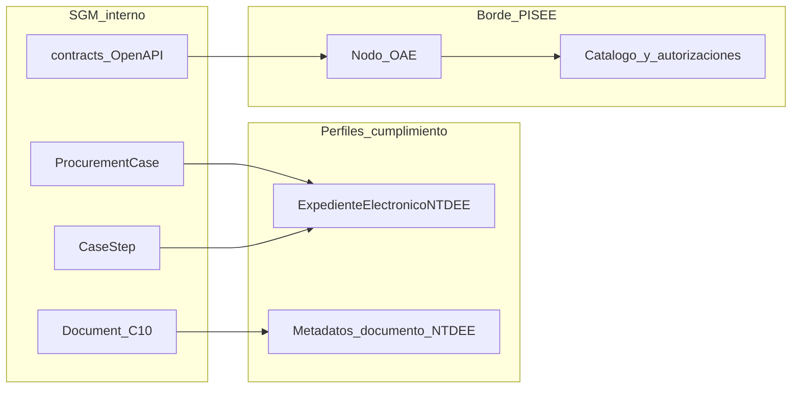

# Brechas y propuestas de estandarización — NTDEE / PISEE

> Documento de trabajo — arquitectura / cumplimiento normativo  
> Estado: **propuesta / borrador** (julio 2026).  
> Alcance: diagnóstico y propuestas. **No** modifica aún `entidades-core.md`, OpenAPI ni el contrato C10; esos cambios se canalizan por los pendientes P-60…P-63.  
> Complementa [`principios-no-negociables.md`](../licitacion/principios-no-negociables.md) §4, [`seguridad.md`](../especificacion/seguridad.md) §1, [`plataforma-core.md`](../especificacion/plataforma-core.md) §7–§7bis.

---

## 1. Propósito y marcos

Este documento evalúa el diseño actual del SGM frente a dos marcos de la Secretaría de Gobierno Digital:

| Marco | Norma | Guía técnica | Qué regula |
|---|---|---|---|
| **NTDEE** | Decreto N° 10, de 2023 | [Guía Técnica de Documentos y Expedientes Electrónicos](https://wikiguias.digital.gob.cl/guias/guia-tecnica-documentosyexpedientes) | Estructura del expediente electrónico, metadatos, formatos, actuaciones, retención, enlaces persistentes, estándar mínimo de plataformas de gestión documental |
| **NTI / PISEE** | Decreto N° 12, de 2023 | [Guía Técnica de Interoperabilidad](https://wikiguias.digital.gob.cl/es/guias/guia-tecnica-interoperabilidad) | Red de interoperabilidad: nodo, servicios centralizados, Portal PISEE, protocolos autorizados, trazabilidad inter-OAE, responsables de servicios |

**Qué no es este documento.** No reescribe Adquisiciones, no redefine entidades de negocio ni obliga a renombrar `ProcurementCase`. No prescribe implementación de código.

### Principio rector

El dominio interno SGM se mantiene (API-first, inglés técnico, contratos por módulo). El cumplimiento normativo se logra con:

1. **Perfiles de mapeo / exportación** hacia el esquema NTDEE.
2. Un **borde PISEE en el core** (SGM habla al nodo del OAE; SGM no *es* el nodo).

---

## 2. Qué ya alinea

| Capacidad SGM | Evidencia | Encaje |
|---|---|---|
| Expediente raíz con timeline | `ProcurementCase`, `CaseStep` en [`entidades-core.md`](../../modelo-datos/entidades-core.md) | Agregación de procedimiento y actuaciones de negocio |
| Documentos centralizados, sin BLOB en módulos | `Document` / `DocumentRef`, C10 en [`entidades-plataforma.md`](../../modelo-datos/entidades-plataforma.md), [`plataforma-core.md`](../especificacion/plataforma-core.md) §7bis | Gestión documental como capacidad de plataforma |
| Contrato HTTP versionado | OpenAPI Adquisiciones, [`contracts.md`](../../modulos/adquisiciones/contracts.md), mandato API | Publicación gobernada de operaciones (base para Catálogo) |
| Auditoría append-only + origen de escrituras M2M | [`seguridad.md`](../especificacion/seguridad.md) §2.2, §5 | Trazabilidad administrativa (distinta de traza PISEE, ver §4) |
| ClaveÚnica + FirmaGob | [`seguridad.md`](../especificacion/seguridad.md) §2.1; `SignatureRequest` | Autenticación Estado y firma en actos administrativos |
| Integraciones externas en el core (C7/C9) | [`contrato-api-first.md`](../especificacion/contrato-api-first.md), [`integracion-mercado-publico.md`](../especificacion/integracion-mercado-publico.md) | Mismo patrón aplicable a un futuro C-PISEE |
| Multi-tenant por municipio | [`decisiones-macro-stack.md`](./decisiones-macro-stack.md) | Cada OAE (municipio) como proveedor/consumidor aislado |

---

## 3. Brechas NTDEE (D.S. N° 10/2023)

Leyenda de estado: **cubierto** · **parcial** · **ausente**.

| Exigencia (referencia guía / norma) | Estado | Evidencia en SGM | Impacto si no se cierra |
|---|---|---|---|
| Política de Gestión Documental y procesos asociados (arts. 3–4) | ausente | No hay artefacto de política; C10 define almacenamiento, no tipologías ni flujos documentales institucionales | Impide demonstrar cumplimiento procesal ante Contraloría / SGD |
| Formatos válidos de documentos electrónicos y proceso de visar formatos nuevos (art. 13) | parcial | `content_type` libre; **P-58** abre MIME/tamaños/retención pero sin lista NTDEE ni flujo de visación | Riesgo de incorporar formatos no admitidos en expediente electrónico |
| Metadatos de documentos — obligatorios / condicionales / sugeridos (art. 14) | parcial | `Document`: `id`, MIME, tamaño, `sha256`, backend, `retention_class`, fechas. Faltan tipología, productor, fechas de incorporación al expediente, clasificación, etc. | Exportación NTDEE incompleta; interoperabilidad documental débil |
| Metadatos de creación del expediente electrónico (art. 18) | parcial | `ProcurementCase`: folio, descripción, unidad, tipo, estado, timestamps, vínculo MP. Falta mapeo explícito a campos mínimos NTDEE (órgano, procedimiento, identificador persistente…) | Identidad del expediente no demostrable frente a la norma |
| Esquema estructural y elementos del expediente (arts. 19–20, 22) | parcial | `CaseStep` modela el **flujo de negocio**, no el índice / componentes NTDEE (actuaciones, índice, vínculos formales) | Confusión flujo ≠ expediente electrónico; auditoría documental incompleta |
| Documentos/datos aportados por interoperabilidad — formatos y metadatos (art. 24) | ausente | No hay tipo ni traza de “origen PISEE / nodo” en `Document` ni en el expediente | Imposible distinguir evidencia interna vs. aportada por otro OAE |
| Expedientes híbridos — excepción documental física (art. 26) | parcial | Existe `signature_mode = scanned` y adjuntos escaneados; no hay modelo de expediente híbrido ni inventario de pieza física | Casos municipales con papel sin regla única |
| Incorporación de comunicaciones oficiales y notificaciones (arts. 27–28) | ausente | DocDigital citado solo como canal de **notificación** (`musts-arquitectura.md` §9), no como incorporación al expediente | Hueco frente a Ley 19.880 / procedimientos administrativos |
| Plazo de disponibilidad / acceso cuando no hay norma de transferencia (art. 32) | parcial | `retention_class` existe; plazos no calibrados (**P-26** es auditoría, no disponibilidad de expediente) | Incumplimiento archivístico / acceso |
| Enlaces persistentes — habilitación técnica (art. 33) | ausente | IDs internos (`ADQ-…`, UUID); sin URI/PID pública estable por expediente o documento | Imposibilidad de referenciar de forma estable en actos e interoperabilidad |
| Registro de actuaciones al expediente (art. 34) | parcial | Transiciones de estado y auditoría cubren hechos de sistema/workflow; no hay entidad/vista “actuación administrativa” NTDEE | Acto administrativo vs. paso de proceso no trazable de forma normativa |
| Estándares mínimos de plataformas de gestión documental/expedientes (art. 35) | parcial | API, RBAC, C10, auditoría apuntan bien; falta checklist explícito contra art. 35 | Brecha en recepción / bases de licitación |

---

## 4. Brechas PISEE / NTI (D.S. N° 12/2023)

| Exigencia | Estado | Evidencia en SGM | Impacto si no se cierra |
|---|---|---|---|
| Nodo como único medio autorizado de intercambio inter-OAE | ausente | No hay capacidad core de cliente/adaptador al nodo; integraciones son MP/FirmaGob/SII (C7/C9) | Cualquier consumo OAE↔OAE por API directa incumple la guía |
| SGM no es el nodo: hospedaje en infraestructura del OAE | — (decisión) | Hosting SUBDERE / híbrido documentado; **quién opera el nodo** (municipio vs. SUBDERE por tenant) no está decidido | Bloquea diseño de C-PISEE y operación |
| Publicación / consumo vía Catálogo de Servicios y Portal PISEE | ausente | OpenAPI existe para M2M municipal y ecosistemas; no hay perfil “servicio de interoperabilidad” ni alta en Catálogo | Otros OAE no pueden descubrir/consumir datos SGM por la Red |
| Autenticación mutua, cifrado E2E y protocolos autorizados | ausente en borde PISEE | TLS y secretos sí en perímetro SGM ([`seguridad.md`](../especificacion/seguridad.md) §7); no equivalen a requisitos del nodo | No sustituible “solo con HTTPS propio” |
| Registro de trazabilidad PISEE (metadatos de transacción inter-nodo) | ausente | Auditoría SGM (§5 seguridad) es **otra** capa — no genera traza hacia servicios centralizados PISEE | Doble registro: hay que diseñar ambos, no fusionarlos |
| Gestor de Autorizaciones para datos sensibles | ausente | Scopes OAuth M2M por módulo/municipio; sin integración al Gestor de Autorizaciones | Consumos sensibles inter-OAE sin permiso normativo |
| Prohibición de vías paralelas al Catálogo para OAE↔OAE | ausente (regla) | Modelo abierto API favorece ecosistema; falta regla explícita: M2M del *mismo* OAE OK; OAE distinto → nodo | Riesgo de diseñareludir el nodo “porque ya hay OpenAPI” |
| Designación de responsables de información y de publicación de servicios (arts. 7–8 NTI) | ausente | RBAC municipal sí; no hay rol/responsable PISEE por servicio publicado | Impide enrolamiento formal en Portal PISEE |
| Validación de nodo propio / proveedor externo (si aplica) | fuera por ahora | SGD disponibiliza nodo; alternativa propia requiere validación 15 días hábiles | Solo relevante si SUBDERE o municipio optan por nodo no oficial |

---

## 5. Propuestas de estandarización

### 5.1 Perfil `ExpedienteElectronicoNTDEE`

Vista / DTO de cumplimiento proyectado sobre `ProcurementCase` + `CaseStep` + documentos vinculados + actuaciones. **No** reemplaza el modelo de dominio.

- Operación candidata en core o módulo: `exportElectronicCase` / `getNtdeeCaseView` (nombre a fijar en P-60).
- Consumidores: Contraloría, auditoría, exportación a otro OAE vía nodo, certificación de conformidad.

### 5.2 Matriz de mapeo (borrador)

Acción: `usar` (campo existente alcanza) · `extender` (enriquecer semántica) · `nuevo` (campo o entidad a agregar).

#### Expediente → NTDEE (art. 18 y estructura)

| Concepto norma (resumen) | Campo / artefacto SGM | Acción |
|---|---|---|
| Identificador del expediente | `ProcurementCase.id` / `folio` | extender — asociar PID/URI (art. 33) |
| Órgano / tenant | `tenant_id` (implícito) + datos del `Tenant` | extender — exponer en perfil |
| Materia / descripción | `description` | usar |
| Tipo de procedimiento | `procurement_type` | extender — mapear a tipología procedimental NTDEE |
| Estado | `status` | extender — vocabulario dual negocio / documental |
| Fecha de apertura | `created_at` | usar |
| Unidad productora | `requesting_unit_id` | usar |
| Índice / componentes | derivado de `CaseStep` + docs | nuevo — capa índice NTDEE |
| Actuaciones | auditoría + transiciones | nuevo — proyección `CaseActuation` o equivalente en el perfil |
| Vínculo proceso externo (MP) | `mp_process_id`, `mp_linked_at` | usar en perfil como referencia externa |
| Enlace persistente | — | nuevo |

#### Documento → NTDEE (arts. 13–14)

| Concepto norma (resumen) | Campo SGM | Acción |
|---|---|---|
| Identificador | `Document.id` | extender — PID |
| Formato / MIME | `content_type` | extender — lista blanca NTDEE (P-58) |
| Integridad | `sha256` | usar |
| Tamaño | `size_bytes` | usar |
| Retención / clase | `retention_class` | extender — catálogo alineado art. 32 |
| Tipología documental | — | nuevo |
| Productor / autor institucional | — | nuevo (ref. `User` / unidad) |
| Fecha de creación del documento | `created_at` (hoy = alta en C10) | extender — separar creación vs. incorporación |
| Fecha de incorporación al expediente | — | nuevo |
| Origen interoperabilidad | — | nuevo (flag + metadatos art. 24) |
| Versión firmada | vía `SignatureRequest.signed_document_ref` | usar |

### 5.3 Extensión C10 / `Document` (alimenta P-58 y P-60)

Sin implementar aquí: tipología, productor, fechas de incorporación, origen PISEE, lista MIME NTDEE, política de visación de formatos, PID.

### 5.4 Capacidad core **C-PISEE**

Mismo patrón que C7 (MP) / C9 (FirmaGob, SII) / C10 (documentos):

- El módulo declara operaciones de negocio; el **core** adapta mensajes al nodo, custodia certificados/credenciales de nodo por tenant y registra traza hacia servicios centralizados.
- Configuración candidata: `TenantIntegrationConfig` + proveedor `pisee` (**P-57** / **P-61**).
- Decisión operativa a fijar en P-61: nodo provisionado por SGD operado por el municipio, vs. nodo en infraestructura SUBDERE en nombre del tenant (hosting completo).

### 5.5 Servicios candidatos a Catálogo PISEE (inicial)

Solo lectura, mínimo privilegio, siempre vía nodo:

| Servicio (propuesta) | Operación SGM de origen | Notas |
|---|---|---|
| Consulta de expediente de compra (metadatos) | `getProcurementCase` + perfil NTDEE | Sin documentos sensibles por defecto |
| Consulta de documento autorizado | `getDownloadUrl` / metadata Document | Requiere Gestor de Autorizaciones si sensible |
| Verificación de existencia / estado | `listProcurementCases` filtrado | Uso intermunicipal acotado |

Escrituras inter-OAE quedan fuera del alcance inicial.

### 5.6 Distinción de trazas

| Capa | Para qué | Dónde vive |
|---|---|---|
| Auditoría SGM | Contraloría municipal, SoD, Ley 21.719, recepción | Core auditoría ([`seguridad.md`](../especificacion/seguridad.md) §5) |
| Trazabilidad PISEE | Metadatos de mensaje inter-nodo exigidos por NTI | Emitidos por el nodo / C-PISEE hacia servicios centralizados |

No fusionar ambas en un solo log.

### 5.7 Actualización del marco documental interno

Citar explícitamente D.S. N° 10/2023 y D.S. N° 12/2023 en principios y seguridad (este entregable). Checklist art. 35 NTDEE como anexo futuro de recepción (P-60).

---

## 6. Pendientes nuevos

Registrados en [`pendientes.md`](./pendientes.md):

| ID | Título corto | Depende / relaciona |
|---|---|---|
| **P-60** | Matriz definitiva SGM ↔ NTDEE; perfil `ExpedienteElectronicoNTDEE`; campos nuevos en `Document` / expediente; checklist art. 35 | P-58, P-26 |
| **P-61** | Borde C-PISEE: quién opera el nodo, adaptador core, servicios Catálogo iniciales, traza PISEE vs auditoría | P-57, P-48 |
| **P-62** | Política de Gestión Documental (artefacto) y soporte en C10 (tipologías, retención, formatos, visación) | P-58, P-60 |
| **P-63** | Enlaces persistentes (art. 33) y plazo de disponibilidad de expedientes/documentos (art. 32) | P-26, P-60 |

---

## 7. Fuera de alcance de este documento

- Cambios de schema en `entidades-*.md` o migraciones.
- Cambios OpenAPI / fixtures / prototipos HTML.
- Implementación del nodo o enrolamiento en Portal PISEE.
- Redacción completa de la Política de Gestión Documental municipal/SUBDERE (solo se exige el pendiente P-62).

---

## 8. Criterio de decisión para el equipo

Ante la pregunta «¿hay que rediseñar el expediente de Adquisiciones?»:

**No.** Hay que (1) publicar un **perfil NTDEE** sobre el modelo actual, (2) **extender metadatos** documentales donde la matriz marque `nuevo`/`extender`, y (3) añadir el **borde C-PISEE** para intercambio entre OAE, manteniendo la API OpenAPI para consumidores del mismo organismo y del ecosistema autorizado sin confundirla con la Red de Interoperabilidad.

---

## Fuentes

- [Guía Técnica de Documentos y Expedientes Electrónicos](https://wikiguias.digital.gob.cl/guias/guia-tecnica-documentosyexpedientes) (Decreto N° 10/2023).
- [Guía Técnica de Interoperabilidad](https://wikiguias.digital.gob.cl/es/guias/guia-tecnica-interoperabilidad) (Decreto N° 12/2023); [¿Qué es PISEE?](https://pisee.gob.cl/que-es-pisee/); [Manual configuración Nodo v2](https://wikiguias.digital.gob.cl/Manuales/configuracion-nodo).
- Diseño SGM: entidades core/plataforma, seguridad, plataforma-core, contratos Adquisiciones, pendientes P-26 y P-58.
