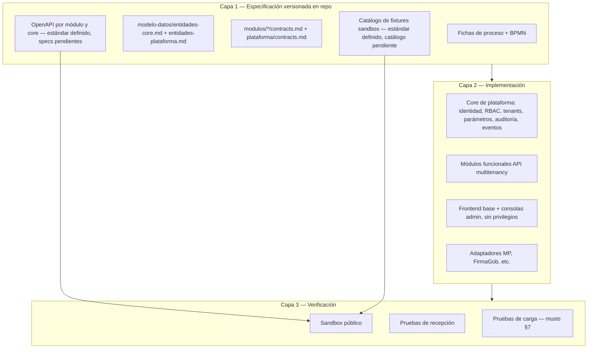
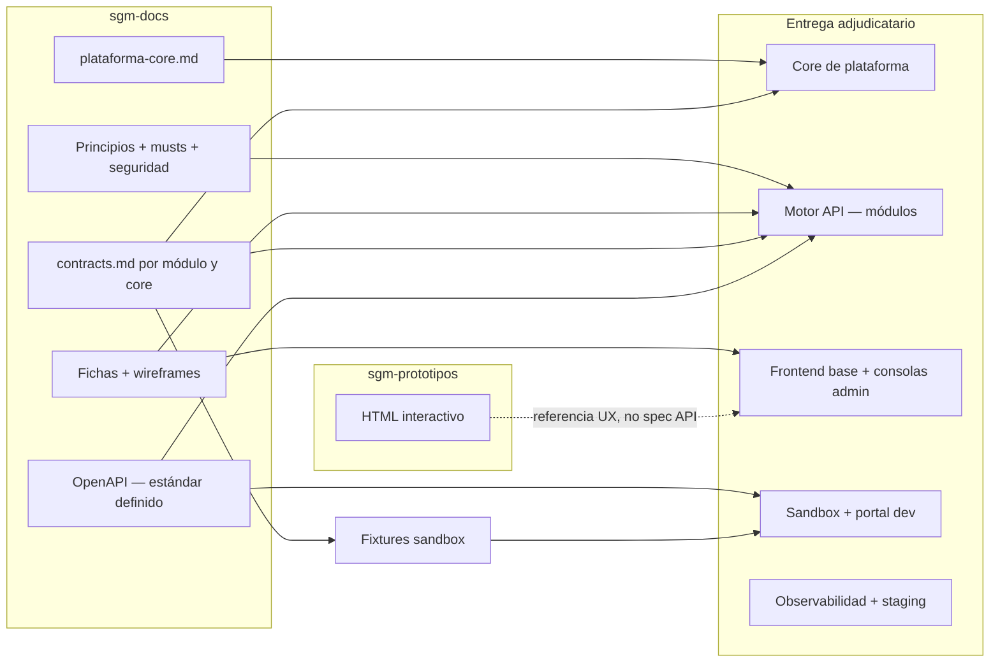

# Entregable exigible de licitación: API, contratos y sandbox

> Documento de trabajo — arquitectura / licitación
> Estado: borrador para discusión interna, **v2** (julio 2026).
> Origen: conversación de arquitectura sobre el modelo «API como producto», el ambiente sandbox y la paridad contrato ↔ implementación. La v2 incorpora: el criterio de nivel de detalle de la especificación (§3), el core de plataforma como parte del entregable (§4), y la adopción del estándar OpenAPI + fixtures ([`estandar-openapi-fixtures.md`](./estandar-openapi-fixtures.md)).
> Pendientes relacionados registrados en [`pendientes.md`](./pendientes.md).

---

## 1. Propósito de este documento

Este documento consolida lo discutido antes de ampliar la especificación. Define **qué debe poder exigir SUBDERE en las bases** y **qué debe entregar el adjudicatario** para que un implementador tome este repositorio y construya el sistema de forma íntegra, sin ingeniería inversa ni privilegios ocultos.

No sustituye los documentos normativos existentes (`principios-no-negociables.md`, `estandares-api.md`, `musts-arquitectura.md`, fichas de proceso, `contracts.md`). Los **organiza en un modelo de entregable único** e identifica los huecos que hoy impiden cerrar ese modelo.

**Lectura recomendada en paralelo:** [`decisiones-macro-stack.md`](./decisiones-macro-stack.md) §1, §6 y §7; [`plataforma-core.md`](./plataforma-core.md).

---

## 2. Tesis central: la API es el producto

SGM se concibe como **motor backend API-first**. El frontend base de SUBDERE es un consumidor más, sin atajos. Dos modos de consumo (hosting completo y módulos à la carte vía API) comparten el mismo contrato publicado.

**Consecuencia para la licitación:** el adjudicatario no entrega «una aplicación web con backend adjunto». Entrega:

1. Un **motor** que implementa contratos versionados — módulos funcionales **y core de plataforma** ([`plataforma-core.md`](./plataforma-core.md)).
2. Un **frontend base** que consume exclusivamente esos contratos, incluidas las consolas de administración.
3. Un **sandbox público** donde cualquier tercero reproduce la integración antes de producción.
4. La **documentación ejecutable** que hace verificable cada uno de los puntos anteriores.

La ventaja competitiva legítima de un integrador o tercero debe ser calidad de servicio y dominio, nunca acceso privilegiado a endpoints o datos no publicados ([`decisiones-macro-stack.md`](./decisiones-macro-stack.md) §7.2.5).

---

## 3. Criterio de nivel de detalle: qué se especifica completo y qué se recibe contra propiedades

El desarrollo externo es una decisión de velocidad; la capacidad de corregir después de la recepción permanece en SUBDERE. Eso define **dónde invertir el detalle de la especificación**: no en eliminar todo error posible, sino en garantizar que los errores sean **detectables en recepción y baratos de corregir en operación**. El criterio ordenador es la **reversibilidad**:

### 3.1 Especificación completa (errores caros o imposibles de corregir después)

Decisiones estructurales que, mal resueltas, no se corrigen con un fix menor. Se especifican al 100% en el repositorio y se verifican en recepción, sin margen de interpretación del adjudicatario:

| Qué | Dónde está especificado |
|---|---|
| Multitenancy por schema y aislamiento de datos | `principios-no-negociables.md` §2, `musts-arquitectura.md` §3 |
| Frontend base sin privilegios (paridad de acceso) | `principios-no-negociables.md` §1 |
| Contratos versionados con OpenAPI como fuente de verdad | `estandares-api.md` §1–§2, `estandar-openapi-fixtures.md` |
| Paridad sandbox ↔ producción | §5 de este documento |
| Validación bloqueante en servidor; errores estructurados | `principios-no-negociables.md` §7, `estandares-api.md` §3 |
| Ausencia de orquestador central; coordinación por contratos y eventos | `plataforma-core.md` §1 |
| Propiedad del código y portabilidad | `principios-no-negociables.md` §5 |
| Superficie de la API: operaciones, esquemas expuestos, reglas bloqueantes | `contracts.md` por módulo + OpenAPI |

### 3.2 Especificación por propiedades verificables (el *cómo* es del adjudicatario)

Donde prescribir implementación trasladaría a SUBDERE la responsabilidad por diseños ajenos y restringiría competencia sin beneficio. Se exige la propiedad y su prueba de recepción; el diseño interno es del oferente:

| Qué | Propiedad exigida |
|---|---|
| Persistencia interna de cada módulo | Libre, mientras el contrato se cumpla y las BD de otros módulos sean inaccesibles |
| Implementación de flujos (motor BPM o máquinas de estado) | Propiedades de `musts-arquitectura.md` §10, sin exigir herramienta |
| Stack tecnológico | Propiedades de `principios-no-negociables.md` §3, sin marcas |
| Infraestructura del sandbox y del portal | Requisitos de §5, recibidos contra criterios, no contra manual de construcción |
| Diseño visual del frontend | Wireframes especifican estructura y operaciones; la estética es del adjudicatario (`plantilla-maestra-sgm.md` §7) |

### 3.3 Corregible en operación (tolerancia explícita)

Errores esperables de especificación que el modelo absorbe sin crisis, porque el mecanismo de corrección está especificado: campos y endpoints se agregan de forma **aditiva** bajo versionamiento semántico (`estandares-api.md` §2); valores normativos se corrigen vía `NormativeParameter` sin despliegue; fixtures y examples se deprecan y reemplazan con aviso. La existencia de este mecanismo — no la perfección de la primera versión — es lo exigible en bases.

**Regla práctica:** ante la duda de cuánto detallar, preguntarse si un error en esa definición se corrige de forma aditiva post-recepción. Si sí, basta el nivel «suficiente para licitar» con el pendiente marcado. Si no, se especifica completo antes de las bases.

---

## 4. Modelo de entregable: tres capas verificables

### 4.1 Capa 1 — Especificación (este repositorio)

| Artefacto | Ubicación | Rol en el entregable |
|---|---|---|
| Principios no negociables | `arquitectura/principios-no-negociables.md` | Cláusulas de bases no delegables |
| Estándares API transversales | `arquitectura/estandares-api.md` | Errores, paginación, idempotencia, auth |
| Estándar OpenAPI y fixtures | `arquitectura/estandar-openapi-fixtures.md` | Formato de specs y catálogo sandbox |
| Metodología contract-first | `arquitectura/contrato-api-first.md` | Estructura de `contracts.md`, criterio de recepción |
| **Core de plataforma** | `arquitectura/plataforma-core.md` | Servicios transversales, entidades de plataforma, consolas admin |
| Musts NFR | `arquitectura/musts-arquitectura.md` | SLOs, carga, observabilidad, flujos consultables |
| Seguridad | `arquitectura/seguridad.md` | Personas (Clave Única) y sistemas (M2M) |
| Modelo de datos canónico | `modelo-datos/entidades-core.md` (+ `entidades-plataforma.md`, a crear) | Fuente única de entidades y campos |
| Fichas de proceso | `modulos/*/procesos-transversales/`, modalidades | Reglas de negocio, materias, bordes §3.5 |
| Contrato funcional por módulo | `modulos/*/contracts.md` + `plataforma/contracts.md` (**P-48**) | Operaciones, entradas `{a}`, salidas `{b}`, eventos |
| OpenAPI | `modulos/*/openapi/` (**a crear según estándar**) | Esquemas formales; código validado contra spec |
| Wireframes | `modulos/*/wireframes/*.md` + consolas admin (**P-52**) | Entregable de licitación — estructura UI |
| Prototipos HTML | `sgm-prototipos/` | Validación UX; **no** sustituye API ni sandbox |

**Regla de oro ([`estandares-api.md`](./estandares-api.md) §1):** ante discrepancia entre `contracts.md` y OpenAPI, se resuelve la inconsistencia antes de dar por cerrado cualquiera de los dos. El código se valida contra OpenAPI, no al revés.

### 4.2 Capa 2 — Implementación (adjudicatario)

El implementador debe construir, como mínimo:

| Componente | Exigencia verificable |
|---|---|
| **Core de plataforma** | Contrato propio cumplido; consolas admin como consumidores sin privilegios; ciclo de tenants demostrable ([`plataforma-core.md`](./plataforma-core.md) §10) |
| API REST por módulo | Cumple OpenAPI publicada; sin endpoints no documentados |
| Multitenancy por schema | Separación por municipio; pooling y migraciones demostrables |
| Frontend base | Consume la misma API que un tercero; sin rutas internas privilegiadas |
| Motor de validación | Reglas bloqueantes en servidor; errores con esquema de `estandares-api.md` §3 |
| Integraciones declaradas | Solo contratos de dependencia en `contracts.md` §3; MP read-only |
| Observabilidad | Métricas por endpoint y tenant, trazas entre módulos, logs estructurados |
| Capa de lectura agregada | Reportería nacional sin cruzar la transaccional (`musts-arquitectura.md` §4) |

### 4.3 Capa 3 — Verificación (recepción y ecosistema)

| Mecanismo | Qué demuestra |
|---|---|
| Pruebas de integración entre módulos | Cada módulo consume **solo** contratos publicados; BD de otros inaccesibles ([`contrato-api-first.md`](./contrato-api-first.md) §1) |
| Pruebas de carga | SLOs bajo perfil de pico (`musts-arquitectura.md` §6–7) |
| Trazabilidad BPMN | Comportamiento demostrable contra especificación de flujo |
| **Sandbox público** | Tercero integra sin convenio previo; misma API que producción |
| **Fixtures documentados** | Request `{a}` → response `{b}` reproducible en IDs conocidos; reproducidos por la contraparte en recepción (`estandar-openapi-fixtures.md` §6.3) |

---

## 5. El sandbox como parte del entregable, no como accesorio

### 5.1 Lo que ya está decidido

En [`decisiones-macro-stack.md`](./decisiones-macro-stack.md) §7.2, el sandbox es condición habilitante del ecosistema:

> *Ambiente sandbox con datos sintéticos. Cualquier empresa debe poder desarrollar y demostrar su servicio sin convenio previo, contra un ambiente de prueba públicamente accesible.*

Hoy está registrado como **[PENDIENTE P-16]**; este documento es el marco y el formato de fixtures ya está normado; falta el detalle operativo (`sandbox-desarrolladores.md`).

### 5.2 Lo que el sandbox NO es

| No es | Por qué |
|---|---|
| Los prototipos HTML (`sgm-prototipos/`) | Simulan UX en cliente; no ejecutan contratos HTTP |
| Un mock con API distinta a producción | Rompe paridad de acceso y hace inútil la certificación |
| Solo pruebas de carga del proveedor | Eso cubre recepción interna, no adopción por terceros |
| El sandbox de ChileCompra | Ese certifica integración con MP; este certifica integración con SGM |

### 5.3 Lo que el sandbox SÍ debe ser

1. **Mismo motor** (o mismo artefacto desplegado) que producción, con configuración de entorno sandbox.
2. **Mismos endpoints, esquemas y errores** que OpenAPI publicada — incluido el contrato del core (autenticación, consulta de identidad y roles, auditoría), necesario para que un integrador pruebe el flujo completo.
3. **Credenciales M2M de prueba** obtenibles sin convenio (self-service o registro simple), alineado con **[P-02]** y **[P-15]**.
4. **Datos sintéticos** — nunca datos reales de municipios (Ley 21.719).
5. **Catálogo de fixtures versionado** según [`estandar-openapi-fixtures.md`](./estandar-openapi-fixtures.md) §6 — expedientes y escenarios con IDs estables y respuestas documentadas.
6. **Portal de desarrollador** — OpenAPI navegable, guías de inicio, ejemplos `{a}`/`{b}` por operación.
7. **Stubs controlados** de dependencias externas (Mercado Público, FirmaGob) con comportamiento documentado.

### 5.4 Tres entornos que deben distinguirse explícitamente

| Entorno | Público | Datos | Propósito |
|---|---|---|---|
| **Sandbox** | Sí — integradores y terceros | Sintéticos, fixtures, reset periódico | Desarrollo, demos, certificación previa |
| **Staging / pre-producción** | No — contraparte técnica SUBDERE | Anonimizados o sintéticos de alta fidelidad | Recepción, pruebas de carga, UAT |
| **Producción** | Municipios y sistemas autorizados | Reales | Operación |

---

## 6. Paridad contrato: envío `{a}`, recepción `{b}`

### 6.1 Qué significa en la práctica

Cada operación publicada define:

- **Request `{a}`:** método, ruta, headers (auth, idempotencia), query, body JSON con esquema y obligatoriedad.
- **Response `{b}`:** código HTTP, body de éxito o error estructurado (`error_code`, `rule`, `severity`, etc.).
- **Reglas:** qué validaciones bloquean, qué dependencias se invocan, qué eventos se emiten.

El sandbox debe permitir ejecutar esa operación y obtener `{b}` conforme a OpenAPI. Los fixtures publican **ejemplos canónicos** para operaciones de lectura y para errores de dominio frecuentes. El formato técnico de ambos está normado en [`estandar-openapi-fixtures.md`](./estandar-openapi-fixtures.md) §4 y §6.

### 6.2 Estado actual del piloto Adquisiciones

`modulos/adquisiciones/contracts.md` documenta operaciones de **escritura y transición** con entrada/salida en prosa funcional. Ejemplo existente:

- `POST /purchase-requests` — entrada: `PurchaseRequest` + líneas; salida: `PurchaseRequest` con `status = draft`.

**Huecos detectados (julio 2026), estado en v2:**

| Hueco | Impacto | Estado |
|---|---|---|
| No hay OpenAPI en el repositorio | Sin esquema formal `{a}`/`{b}` validable | **Estándar definido**; spec de Adquisiciones por crear |
| Casi no hay operaciones `GET` | Falta lectura de expedientes y recursos | Abierto — prioridad 1 (§10) |
| `ProcurementCase` y `CaseStep` marcados internos | El expediente no está en entidades expuestas de `contracts.md` §1 | Abierto — prioridad 1 (§10) |
| Vista de expediente sin operación API | `musts-arquitectura.md` §10.2 exige estado vía API; el contrato no cierra la operación | Abierto — prioridad 1 (§10) |
| Prototipos desacoplados de contrato | IDs demo en cliente sin fixture API equivalente | **Regla de alineación definida** (`estandar-openapi-fixtures.md` §6.2.5); catálogo por crear |
| Sin contrato del core | Los módulos asumen identidad/roles/auditoría sin interfaz declarada | **Nuevo — [P-48]**, marco en `plataforma-core.md` |

### 6.3 Operaciones de lectura pendientes de modelar (propuesta de trabajo)

Para que un implementador — o un municipio en modo à la carte — pueda «consultar expediente N de Adquisiciones», el contrato debe cerrar al menos:

| Operación propuesta | Propósito |
|---|---|
| `GET /procurement-cases` | Listado paginado y filtrable (folio, modalidad, estado, unidad) |
| `GET /procurement-cases/{id}` | Cabecera del expediente: folio, `procurement_type`, `status`, paso actual |
| `GET /procurement-cases/{id}/steps` | Timeline de `CaseStep`: estado, responsable, tiempos |
| `GET /purchase-requests/{id}` | Detalle documental SOLPED y líneas |
| Recursos hijos por expediente o por ID | Órdenes, recepciones, CDP, etc., según scopes |

Estas operaciones deben exponer `ProcurementCase` y `CaseStep` en `contracts.md` §1 y generar entradas en OpenAPI con `examples` que alimenten el catálogo de fixtures del sandbox.

**Criterio de cierre:** dos equipos independientes construyen un visor de expediente consumiendo solo el contrato publicado — misma prueba de calidad que [`contrato-api-first.md`](./contrato-api-first.md) §6.4.

---

## 7. Mapa: del repositorio al sistema licitado

Un implementador que clone este repositorio debe poder derivar **sin ambigüedad** cada pieza del sistema:

| Pregunta del implementador | Dónde responde el repo hoy | Estado |
|---|---|---|
| ¿Qué reglas de negocio aplican? | Fichas de proceso + QA | Parcial por modalidad |
| ¿Qué entidades y campos existen? | `entidades-core.md` (+ `entidades-plataforma.md`) | En curso |
| ¿Qué operaciones expone el módulo? | `contracts.md` | Piloto CA; lecturas incompletas |
| **¿Qué hay debajo de los módulos (identidad, roles, tenants, admin)?** | [`plataforma-core.md`](./plataforma-core.md) | **Marco definido; contrato P-48** |
| ¿Cuál es el JSON exacto de request/response? | OpenAPI según `estandar-openapi-fixtures.md` | Estándar definido; specs por crear |
| ¿Cómo se ve la pantalla? | Wireframes + prototipos | Adquisiciones transversal avanzado; consolas admin P-52 |
| ¿Cómo pruebo sin producción? | Sandbox | Marco en §5; detalle operativo P-16 |
| ¿Qué SLOs y pruebas de carga? | `musts-arquitectura.md` | Definido |
| ¿Cómo autentico M2M? | `estandares-api.md` §8 | **[P-02]** abierto |

---

## 8. Catálogo de fixtures sandbox

El formato y las reglas del catálogo están normados en [`estandar-openapi-fixtures.md`](./estandar-openapi-fixtures.md) §6. Los cuatro fixtures iniciales propuestos (IDs alineados con `sgm-prototipos/shared/expedientes-demo.js`):

| Fixture ID | Tenant demo | Estado de negocio | Uso principal |
|---|---|---|---|
| `ADQ-2026-00123` | `municipio-demo-norte` | Compra Ágil — post etapa 2, etapa 3 pendiente | Tutorial integrador; GET expediente |
| `ADQ-2026-00089` | `municipio-demo-norte` | Convenio Marco — ruta por definir en etapa 3 | Variante modalidad |
| `ADQ-2026-00045` | `municipio-demo-sur` | Licitación — showcase finalizado transversal | Lectura estado terminal |
| `ADQ-2026-00012` | `municipio-demo-sur` | Trato Directo — etapa 3 pendiente | Causal y resolución fundada |

Escenarios transaccionales adicionales (no solo lectura):

| Escenario | Operación | `{b}` esperado |
|---|---|---|
| Crear SOLPED válida | `POST /purchase-requests` | `201`, `status: draft` |
| SOLPED sin saldo | `POST .../budget-verification` | `422`, `BUDGET_UNAVAILABLE` |
| Modalidad improcedente | `POST .../modality` | `422`, `MODALITY_AMOUNT_EXCEEDED` |

El catálogo vive en `modulos/<módulo>/fixtures/` y se despliega con el sandbox.

---

## 9. Qué debe poder exigir SUBDERE en las bases (checklist)

Lista consolidada para traducir a cláusulas de licitación. Detalle normativo en documentos referenciados.

### 9.1 Especificación y contrato

- [ ] OpenAPI versionada por módulo **y por el core** en repositorio estatal, según `estandar-openapi-fixtures.md`; código validado contra spec.
- [ ] `contracts.md` por módulo con las cuatro secciones de [`contrato-api-first.md`](./contrato-api-first.md) §3; ídem para el core (**[P-48]**).
- [ ] Política de deprecación publicada (**[P-04]**).
- [ ] Multitenancy explícita en contrato (**[P-03]**).
- [ ] Operaciones de lectura que permitan integración sin UI (expediente, estado de flujo).

### 9.2 Implementación

- [ ] Core de plataforma según [`plataforma-core.md`](./plataforma-core.md) §10: sin orquestador central de procesos; ciclo de tenants demostrable; parámetros con gobernanza diferenciada.
- [ ] Consolas de administración (SUBDERE y municipal) como consumidores sin privilegios; toda acción administrativa es operación de API auditada.
- [ ] Frontend base sin privilegios sobre la API pública.
- [ ] Errores estructurados en toda respuesta `4xx`/`5xx` de negocio.
- [ ] Idempotencia en escrituras sensibles.
- [ ] Validación bloqueante en servidor; clasificación síncrona/asíncrona/cacheada por dependencia.
- [ ] Eventos de dominio según contrato; mecanismo de entrega especificado (**[P-05]**).

### 9.3 Sandbox y ecosistema

- [ ] Sandbox públicamente accesible con datos sintéticos (**[P-16]** — este documento es insumo).
- [ ] Registro o emisión de credenciales M2M de prueba sin convenio de producción.
- [ ] Catálogo de fixtures con IDs estables y ejemplos `{a}`/`{b}` según `estandar-openapi-fixtures.md` §6.
- [ ] Portal de desarrollador con OpenAPI interactiva.
- [ ] Paridad sandbox ↔ producción en contrato; sin endpoints exclusivos de sandbox.
- [ ] Procedimiento de acceso a producción publicado (**[P-15]**).

### 9.4 Recepción

- [ ] Pruebas de integración cross-módulo solo vía contratos.
- [ ] Pruebas de carga con perfil de pico y SLOs medibles.
- [ ] Demostración de trazabilidad contra BPMN de especificación.
- [ ] Evidencia de migraciones multi-tenant a escala de referencia.
- [ ] Reproducción de fixtures por la contraparte técnica contra el ambiente de recepción (`estandar-openapi-fixtures.md` §6.3).

### 9.5 Propiedad y portabilidad

- [ ] Código en repositorio SUBDERE; motor en infraestructura SUBDERE ([`principios-no-negociables.md`](./principios-no-negociables.md) §2, §5).

---

## 10. Brechas prioritarias antes de cerrar el entregable

Orden sugerido de trabajo en el repositorio (sin implementar código aún):

| Prioridad | Trabajo | Desbloquea |
|---|---|---|
| **1** | Completar operaciones de lectura en `contracts.md` (expediente, steps, listados) | Integradores y frontend paritario |
| **2** | Crear OpenAPI del módulo Adquisiciones según `estandar-openapi-fixtures.md` | Validación automática, portal dev |
| **3** | Redactar `plataforma/contracts.md` (**[P-48]**) | Dependencias de módulos hacia el core como interfaces |
| **4** | Redactar `sandbox-desarrolladores.md` (especificación operativa P-16) | Bases y consulta al mercado (**[P-19]**) |
| **5** | Catálogo de fixtures alineado con prototipos demo | Sandbox demostrable |
| **6** | Cerrar P-02, P-03, P-04, P-05, P-51 | Contrato definitivo y autenticación en sandbox |
| **7** | Extender contrato y fixtures a las otras modalidades | Entregable Adquisiciones completo |

---

## 11. Relación con consulta al mercado

[`decisiones-macro-stack.md`](./decisiones-macro-stack.md) §9 establece que SUBDERE llega a la consulta al mercado con **borrador de estándares**, no con página en blanco. Este documento — junto con `plataforma-core.md`, el estándar OpenAPI + fixtures y la especificación de sandbox — forma parte del **borrador mínimo** que permite al mercado estimar viabilidad y costo de integración (**[P-19]**).

La mesa técnica de estándares (API, contratos, sandbox, convenio de acceso) es el foro para iterar este modelo antes y después de la licitación del motor.

---

## 12. Decisiones explícitas

| # | Decisión / acuerdo de trabajo |
|---|---|
| D-01 | El sandbox es parte del entregable de licitación, no un optional post-proyecto. |
| D-02 | El sandbox ejecuta el mismo contrato que producción; datos y credenciales cambian, la API no. |
| D-03 | Los prototipos HTML validan UX; el sandbox valida integración HTTP. Son complementarios. |
| D-04 | Toda operación publicada debe ser expresable como `{a}` → `{b}` en OpenAPI con ejemplos. |
| D-05 | Las operaciones de lectura del expediente son prerequisito del contrato Adquisiciones, no detalle de frontend. |
| D-06 | El catálogo de fixtures es un activo versionado en repo, no documentación informal del proveedor. |
| D-07 | Este documento es insumo para cerrar **[P-16]** y fortalecer **[P-19]**; los cambios en `contracts.md` y OpenAPI son el siguiente paso acordado. |
| D-08 *(v2)* | El nivel de detalle de la especificación se decide por **reversibilidad** (§3): lo estructural se especifica completo; el *cómo* se recibe contra propiedades; lo aditivo tolera corrección post-recepción con mecanismo especificado. |
| D-09 *(v2)* | El core de plataforma es parte del entregable licitado, con contrato y OpenAPI propios y el mismo estándar de recepción que un módulo ([`plataforma-core.md`](./plataforma-core.md)). |
| D-10 *(v2)* | No existe orquestador central de procesos de negocio; la coordinación entre módulos es por contratos y eventos. |
| D-11 *(v2)* | El formato de OpenAPI y fixtures queda normado en [`estandar-openapi-fixtures.md`](./estandar-openapi-fixtures.md); las brechas 2 y 4 de la v1 pasan de «sin estándar» a «estándar definido, artefactos por crear». |

---

## 13. Pendientes y referencias

| ID | Relación con este documento |
|---|---|
| P-02 | Auth M2M — prerequisito de sandbox usable |
| P-03 | Multitenancy en rutas/token — afecta todos los ejemplos `{a}` |
| P-05 | Webhooks — escenarios de integración en sandbox |
| P-15 | Convenio producción vs acceso libre sandbox |
| P-16 | Especificación técnica del sandbox — **este documento es el marco; falta el detalle operativo** |
| P-19 | Borrador mínimo para consulta al mercado |
| P-48 | `plataforma/contracts.md` — contrato del core |
| P-51 | Autorización en runtime — afecta headers de ejemplos `{a}` |
| P-52 | Wireframes de consolas de administración |
| P-53 | Tooling de validación CI de OpenAPI y fixtures |

**Referencias:**

- [`decisiones-macro-stack.md`](./decisiones-macro-stack.md)
- [`plataforma-core.md`](./plataforma-core.md)
- [`estandar-openapi-fixtures.md`](./estandar-openapi-fixtures.md)
- [`contrato-api-first.md`](./contrato-api-first.md)
- [`estandares-api.md`](./estandares-api.md)
- [`musts-arquitectura.md`](./musts-arquitectura.md)
- [`principios-no-negociables.md`](./principios-no-negociables.md)
- [`modulos/adquisiciones/contracts.md`](../modulos/adquisiciones/contracts.md)
- [`sgm-prototipos/README.md`](../../sgm-prototipos/README.md)

---

## 14. Próximo paso acordado

Tras aprobación de esta v2:

1. Completar `contracts.md` de Adquisiciones (capa de lectura + entidades expediente).
2. Generar OpenAPI inicial del piloto según el estándar.
3. Redactar `plataforma/contracts.md` (**P-48**).
4. Redactar especificación operativa del sandbox (`sandbox-desarrolladores.md`).
5. Crear catálogo de fixtures con los IDs demo existentes.

Hasta entonces, **no se considera cerrado el modelo de entregable exigible** para el módulo piloto.