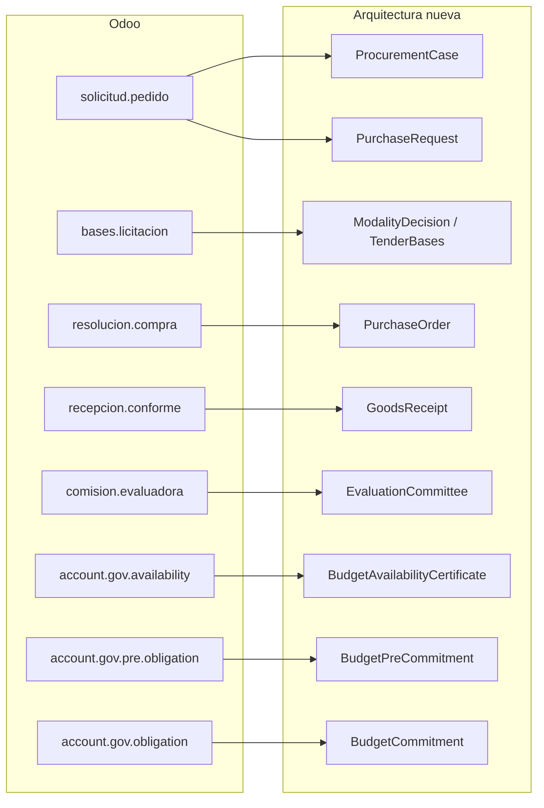
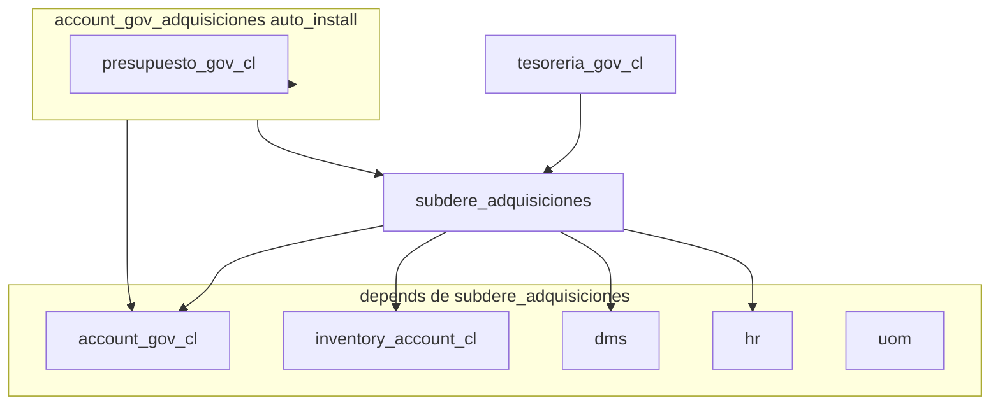

# Comparativa Adquisiciones: Odoo vs arquitectura nueva

**Fecha:** julio 2026  
**Alcance:** campos que existen en Odoo y no (o solo como pendiente) en el dominio nuevo; interdependencias con otros módulos.

## Fuentes

| Lado | Ubicación |
|------|-----------|
| Odoo | `sgm-template/addons/odoo_subdere/subdere_adquisiciones` + puente `account_gov_adquisiciones` |
| Nuevo | este módulo (`contracts.md`, procesos transversales, OpenAPI) |
| BD export (parcial) | [`bd-export-odoo/modulos/account-gov-adquisiciones.md`](../../../bd-export-odoo/modulos/account-gov-adquisiciones.md) |

**Nota:** en Odoo no existe el modelo técnico `solped` ni `purchase.order` estándar. El equivalente de SOLPED es `adquisiciones.solicitud.pedido`.

---

## 1. Mapeo de entidades

| Odoo | Nuevo |
|------|--------|
| `adquisiciones.solicitud.pedido` | `PurchaseRequest` (+ raíz `ProcurementCase`) |
| `adquisiciones.linea.solicitud` | `PurchaseRequestLine` |
| `adquisiciones.bases.licitacion` | `ModalityDecision` / `TenderBases` + vínculo MP |
| `adquisiciones.comision.evaluadora` | `EvaluationCommittee` |
| `adquisiciones.resolucion.compra` | `PurchaseOrder` (+ `QuotationResult` / actos según modalidad) |
| `adquisiciones.linea.resolucion` | líneas de OC (vía recepción: `purchase_order_line_ref`) |
| `adquisiciones.recepcion.conforme` | `GoodsReceipt` |
| `adquisiciones.linea.recepcion` | `GoodsReceiptLine` |
| `account.gov.availability` | `BudgetAvailabilityCertificate` (CDP) |
| `account.gov.pre.obligation` | `BudgetPreCommitment` |
| `account.gov.obligation` | `BudgetCommitment` |
| `adquisiciones.historial` | timeline `CaseStep` + auditoría plataforma |
| `dms.file` / `dms.directory` | `DocumentRef` / `storeDocument` (core C10) |

En Odoo el flujo está acoplado en modelos ORM. En el nuevo, el expediente (`ProcurementCase` + `CaseStep`) orquesta y los bordes son contratos hacia Presupuesto, Contabilidad, Tesorería, Inventario y Core.

---

## 2. Campos que Odoo tiene y el nuevo no (o solo como pendiente)

Prioridad por impacto funcional, analítica y bordes. Columna **Candidato**: adoptar / pendiente ya listado / descartar (modelo distinto a propósito).

### 2.1 SOLPED (`adquisiciones.solicitud.pedido` → `PurchaseRequest`)

| Campo Odoo | En el nuevo | Candidato | Nota |
|---|---|---|---|
| `titulo` | No (solo `description`) | Evaluar | Título corto vs glosa larga |
| `observaciones` | No canónico | Evaluar | Distinto de `justification` |
| `instrucciones_internas` | No | Evaluar / descartar | Notas operativas; puede vivir en comentarios de paso |
| `historial_observaciones` | No (auditoría implícita) | Descartar | Sustituido por bitácora de plataforma |
| `rubro_bien_servicio_id` | **Ausente** — gap en [`analitica.md`](./analitica.md) §9.5 | **Adoptar (decisión DM)** | Clasificador de bien/servicio |
| `derivar_a` (`hr.department`) | No | Evaluar | Derivación a otra unidad |
| `funcionario_envia` | No | Descartar | Texto libre; el actor queda en auditoría |
| Flags `autorizacion_jefatura`, `autorizacion_direccion`, `revision_presupuestaria`, `derivacion_compras` | Estados + firmas FirmaGob | Descartar | Checklist booleana Odoo |
| `firma_solicitante` / `firma_finanzas` / `firma_administracion` | FirmaGob por paso | Descartar | Modelo distinto |
| `fecha_solicitud` + `fecha_estimada` | Solo `requested_date` (+ `created_at` del expediente) | Parcialmente cubierto | Odoo separa creación vs necesidad |

### 2.2 Líneas SOLPED / Resolución

| Campo Odoo | En el nuevo | Candidato | Nota |
|---|---|---|---|
| `is_fixed_asset` en línea | Solo vía `registerInventoryEntry` en 4.3; **no en SOLPED/OC** | **Evaluar (temprano)** | En Odoo se marca desde solicitud/resolución y crea `account.gov.asset` al aprobar recepción |
| Precio sin `tax_code` / moneda documento | Nuevo **sí** tiene `currency` + `tax_code` + `PriceReference` | — | El nuevo supera a Odoo |
| `precio_unitario` sin referencia | Nuevo exige `price_source` | — | Nuevo más estricto |

### 2.3 Bases / modalidad (`adquisiciones.bases.licitacion`)

| Campo Odoo | En el nuevo | Candidato | Nota |
|---|---|---|---|
| `criterios_evaluacion`, `requisitos_tecnicos` (Text) | LP: `EvaluationCriterion[]` estructurado | Cubierto (LP) | Nuevo más rico en LP; Odoo genérico en un solo modelo |
| `garantia_seriedad` / `garantia_cumplimiento` (%) | `Guarantee` + flags en `TenderBases` | Cubierto | Equivalente más formal |
| Snapshot `mp_*` | `MpProcessSnapshot` + `ProcurementCase.mp_*` | Cubierto | Equivalente parcial |
| `decreto_file_ids`, `evidencia_publicacion_file_ids` | `DocumentRef` / `AdministrativeAct` | Cubierto (otro modelo) | Sin DMS |
| `dias_restantes`, `fecha_limite_publicacion` | Timers de flujo / UI | Descartar como campo de dominio | No hace falta persistir si el timer es de plataforma |

### 2.4 Resolución / OC (`adquisiciones.resolucion.compra` → `PurchaseOrder`)

| Campo Odoo | En el nuevo | Candidato | Nota |
|---|---|---|---|
| Datos denormalizados proveedor (`proveedor_rut`, `razon_social`, `direccion`, `telefono`, `email`) | Solo `supplier_rut` (+ name en `QuotationResult`) | Evaluar | Ficha proveedor incompleta en contrato expuesto |
| `plazo_entrega` (días) | No en `PurchaseOrder` expuesto | Evaluar | |
| `gov_tax_id` (`account.gov.tax`) | Impuesto en SOLPED (`tax_code`), no en OC | Descartar / revisar | Convención neto + `tax_code` en 1.1 |
| `resolucion_original_id` + `motivo_recompra` + state `recompra` | Desierto/republicación (CA/CM) sin entidad “recompra” | Evaluar | Flujo Odoo explícito |
| `line_distribution_ids` (cuenta 215*, centro costo, área, programa, subprograma) | Abstracto a `budget_line_id` | **Decisión Presupuestos** | Pérdida de granularidad si no vive en el módulo Presupuestos |
| `obligacion_id`, `egreso_devengado_id` embebidos | Contratos `commitBudget` / `registerAccrual` | Descartar (borde) | Desacoplado a propósito |
| Adjuntos tipados (`contrato_file_ids`, `orden_compra_file_ids`) | `DocumentRef` / catálogo firmables | Cubierto | |

### 2.5 Recepción (`adquisiciones.recepcion.conforme` → `GoodsReceipt`)

| Campo Odoo | En el nuevo | Candidato | Nota |
|---|---|---|---|
| `numero_orden_ingreso` / `fecha_orden_ingreso` | No | Evaluar | Documento de bodega/ingreso |
| `factura_file_ids` / `guia_despacho_file_ids` | Adjuntos genéricos; factura en etapa 5 vía SII | Parcial | En Odoo la factura vive en la recepción |
| `destinatarios_validacion` + flags Presupuesto / Jefe Compras / Control Interno | Roles + SoD (`confirmReceipt`) | Descartar | Modelo de validación distinto |
| `asset_ids` M2M → `account.gov.asset` | `inventory_entry_ref` + **P-44** | Pendiente alcance | Acoplamiento fuerte en Odoo vs contrato |
| Cantidades previas/pendientes en línea | Sí (`quantity_*` en `GoodsReceiptLine`) | Cubierto | |

### 2.6 Otros

| Campo / modelo Odoo | En el nuevo | Candidato |
|---|---|---|
| `adquisiciones.historial` | `CaseStep` + auditoría | Descartar como entidad propia |
| `company_id` multi-compañía | Multitenancy **P-03** | Pendiente plataforma |
| `tupa_file_id` (export BD; **no** en modelo Python core de SP) | Sin TUPA — expediente = `ProcurementCase` | Descartar |
| `dms_directory_id` (mixin DMS) | `DocumentRef` | Descartar |
| Wizards de autorización (individual/masiva SP, bases, RC, recepción, DPP) | Operaciones de API + UI de bandeja | Cubierto por diseño distinto |

---

## 3. Interdependencias

### 3.1 Odoo — dependencias y efectos en el mismo commit

| Momento Odoo | Qué hace | Módulo destino |
|---|---|---|
| Aprobar SOLPED | Crea `bases.licitacion` + (puente) crea **CDP** `account.gov.availability` con líneas | Presupuesto |
| Aprobar resolución | Crea **obligación** + **egreso devengado** (`account.gov.move`) con distribución presupuestaria | Presupuesto + Contabilidad |
| Aprobar recepción | Crea N `account.gov.asset` si `is_fixed_asset` | Inventario / Activo fijo (`inventory_account_cl`) |
| Bases | Consulta API Mercado Público *inline* | Externo (ticket en config) |
| Documentos | `dms.file` M2M tipados | DMS |
| Unidad | `hr.department` | RRHH / org |
| Tesorería | `tesoreria_gov_cl` **depends** de Adquisiciones | Pago/decretos vía TUPA en Tesorería (no embebido en Adq) |

### 3.2 Nuevo — bordes por contrato (sin ORM cruzado)

| Contraparte | Contratos / eventos clave | Estado |
|---|---|---|
| **Presupuestos** | `previewBudgetAvailability`, verificación 1.3, CDP 1.5, preobligación 1.6, `commitBudget` | Documentado |
| **Contabilidad** | `recordAccrual` / `registerAccrual`, `Accrual` | Documentado; tensión **P-46** (devengo en 4.4 vs 5.2) |
| **Tesorería** | `executePayment` (5.4); decreto con FirmaGob | Documentado; frontera **P-47** |
| **Inventario / Activo fijo** | `checkStockAvailability` (1.0), `registerInventoryEntry` (4.3) | **P-44** — no está en los 5 módulos de licitación |
| **Core MP** | `linkMpProcess`, `readMpProcess`, catálogo CM | Solo lectura / deep link |
| **Core docs / FirmaGob** | `storeDocument`, `requestSignature` | Sustituye DMS + firmas booleanas |
| **SII** | `getPriceReference`, `getInvoiceForMatch` | Nuevo respecto a Odoo Adq |
| **TUPA / DMS / hr.department** | No | Reemplazados por expediente + `DocumentRef` + `requesting_unit` |

### 3.3 Hallazgo central

En Odoo, **Presupuesto e Inventario/Activo Fijo se materializan dentro del mismo commit de aprobación** de Adquisiciones. En el nuevo, esos efectos son **dependencias de borde**; Inventario además puede quedar fuera del alcance de bases (**P-44**).

---

## 4. Lo que el nuevo tiene y Odoo no (contexto, no gap)

- Expediente unificado (`ProcurementCase` + `CaseStep`)
- Modalidades separadas (CA / CM / LP / TD) en etapa 3
- Three-way match + factura SII (etapa 5)
- Segregación de funciones (SoD) en recepción
- `PriceReference`, moneda e impuestos en SOLPED
- Recepción no conforme como flujo de primera clase (`ReceiptRejectionCase`)
- OpenAPI y contratos explícitos entre módulos

---

## 5. Decisiones humanas sugeridas

| Tema | Origen Odoo / pendiente | Acción sugerida |
|------|-------------------------|-----------------|
| Rubro / categoría de ítem | `rubro_bien_servicio_id`; [`analitica.md`](./analitica.md) §9.5 | Decir clasificador (ONU-SPSC / presupuestario / ambos) |
| Flag activo fijo temprano | `is_fixed_asset` en líneas SP/RC | ¿Se declara en SOLPED/OC o solo en 4.3 vía umbral? |
| Distribución presupuestaria multi-línea | `line_distribution_ids` (cuenta, área, programa…) | ¿Vive solo en Presupuestos detrás de `budget_line_id`? |
| Orden de ingreso de bodega | `numero_orden_ingreso` / `fecha_orden_ingreso` | ¿Campo de Adquisiciones o del proveedor de inventario? |
| Recompra | `resolucion_original_id` + state `recompra` | ¿Entidad/relación explícita o solo republicación/desierto? |
| Alcance Inventario / Activo fijo | Creación síncrona de `account.gov.asset` | Cerrar **P-44** |
| Momento del devengado | Egreso en aprobación RC vs recepción | Cerrar **P-46** |
| Frontera Pago / Tesorería | Tesorería depende de Adq; pago no está en addons Adq | Cerrar **P-47** |

---

## 6. Referencias

- Contrato: [`contracts.md`](./contracts.md)
- SOLPED: [`procesos-transversales/1-solped.md`](./procesos-transversales/1-solped.md)
- Recepción: [`procesos-transversales/4-recepcion-conforme.md`](./procesos-transversales/4-recepcion-conforme.md)
- Pago: [`procesos-transversales/5-pago.md`](./procesos-transversales/5-pago.md)
- Dimensionamiento Odoo: `sgm-template/docs/dimensionamiento-modulos-funcionales.md`
- Decisión eliminación Odoo: [`arquitectura/decisiones/2026-07-eliminacion-odoo.md`](../../arquitectura/decisiones/2026-07-eliminacion-odoo.md)
