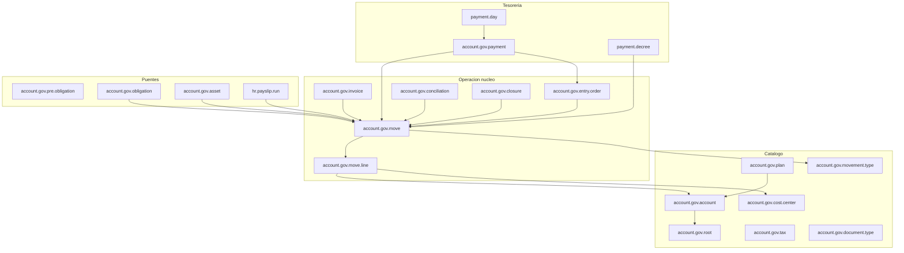

# Modelos Odoo — Contabilidad

**Fecha:** julio 2026  
**Alcance:** inventario as-is de modelos, relaciones y flujos de estado en Odoo. Sin mapeo a la arquitectura nueva.

## Fuentes y alcance

| Fuente | Ubicación | Rol |
|--------|-----------|-----|
| Código (núcleo) | `sgm-template/addons/odoo_subdere/account_gov_cl` | App Contabilidad Gubernamental |
| Código (puente Adq/Presupuesto) | `…/account_gov_adquisiciones` | Preobligación, obligación → egreso devengado |
| Código (activos) | `…/inventory_account_cl` | Activo fijo + depreciación → asiento |
| Código (RRHH) | `…/account_hr_gov_cl` | Nómina / honorarios → asiento + decreto |
| Código (Tesorería, mismo prefijo) | `…/tesoreria_gov_cl` | Ingreso percibido, caja, decretos de pago |
| Código (portal) | `…/portal_tesoreria_gov_cl` | Consulta proveedores (borde) |
| Export BD (parcial / desfasado) | [`bd-export-odoo/modulos/account-gov-cl.md`](../../../bd-export-odoo/modulos/account-gov-cl.md), [`account-gov-adquisiciones.md`](../../../bd-export-odoo/modulos/account-gov-adquisiciones.md), [`tesoreria-gov-cl.md`](../../../bd-export-odoo/modulos/tesoreria-gov-cl.md) | Referencia tabular; ver § Notas |

**Incluye:** plan/cuentas, comprobantes, facturas, órdenes de ingreso y config de asientos, banca/cheques/conciliación, cierres, obligaciones (puente), activos fijos, puente RRHH, modelos `account.gov.*` y satélites de pago/caja definidos en Tesorería.

**No incluye (o solo listado):** wizards transient, reports SQL/xlsx, dummies/legacy, detalle de SOLPED/resolución/CDP (ya en Presupuestos/Adquisiciones — aquí solo el efecto contable), detalle completo de TUPA BPMN.

**Nota:** no es el `account.*` estándar de Odoo Community. Stack propio `account.gov.*` (el núcleo no depende del módulo `account`).

---

## Mapa de addons

| Addon | Rol | depends (declarados) |
|-------|-----|----------------------|
| `account_gov_cl` | Núcleo: plan, cuentas, move, factura, OI, banca, cierre | `base`, `mail`, `dms`, `hr`, `tupa` (+ `openpyxl`) |
| `account_gov_adquisiciones` | Puente auto_install: pre/obligación → egreso devengado | `account_gov_cl`, `subdere_adquisiciones`, `presupuesto_gov_cl` |
| `inventory_account_cl` | Activos fijos + producto en línea de factura | `inventory_gov_cl`, `account_gov_cl`, `mail`, `dms` |
| `account_hr_gov_cl` | Mapeo reglas salariales → asientos; honorarios; ISAPRE | `account_gov_cl`, `tesoreria_gov_cl`, `l10n_cl_hr`, `tupa_hr` |
| `tesoreria_gov_cl` | Percibido, caja diaria, consolidación, decretos, garantías, SEM | `presupuesto_gov_cl`, `account_gov_cl`, `tupa_hr`, `subdere_adquisiciones` |
| `portal_tesoreria_gov_cl` | Portal proveedores (lectura decretos) | `portal`, `tesoreria_gov_cl`, `account_gov_cl` |
| `reports_gov_cl` (satélite) | Reportes CGR/DIPRES | depende de `account_gov_cl` |

`account_gov_cl` es `application=True`; `post_init_hook` carga procedimientos TUPA de conciliación bancaria y factoring.

---

## Diagrama de relaciones



---

## 1. Catálogo

### `account.gov.plan` — Plan de cuentas

| Campo / relación | Tipo | Notas |
|------------------|------|-------|
| `code` | Char | Código del plan |
| `year` | Integer | Año |
| `name` | Char (computed) | |
| `active` | Boolean | |
| `account_ids` | O2M → `account.gov.account` | |

### `account.gov.account` — Cuenta jerárquica

Cuenta del plan CGR / analítica. Eje compartido con Presupuesto (cuentas 115/215).

| Campo / relación | Tipo | Notas |
|------------------|------|-------|
| `plan_id` | M2O → plan | required |
| `parent_id` / `child_ids` | M2O / O2M self | Jerarquía |
| `root_id` | M2O → `account.gov.root` | |
| `code` / `budget_code` | Char | Código contable / presupuestario |
| `title`…`level_5` | Char | Segmentos del código |
| `type` | Selection | `official` / `analytic` (default `analytic`) |
| `official` / `active` / `is_budget_account` | Boolean | |
| `is_final_account` | Boolean (computed) | |
| Contra-cuentas | M2O → account | `contra_account_id`, `fund_account_id`, `previous_year_account_id`, `doubtful_account_id`, `judicial_collection_account_id`, `debtors_account_id`, `discharge_account_id`, `contra_egreso_devengado_id`, `contra_egreso_pagado_id` |
| Montos presupuesto/ejecución | Monetary (computed) | `initial_budget`, `total_budget`, `pre_obligated_amount`, `obligated_amount`, `accrued_expense_amount`, `paid_expense_amount`, etc. |

**Inherit** (puentes): `payment_group_id` → `account.gov.payment.group` (`account_hr_gov_cl`); helpers de pre/obligación (`account_gov_adquisiciones`).

### `account.gov.root`

Árbol de códigos raíz: `name`, `parent_id` → self.

### `account.gov.cost.center`

| Campo | Tipo | Notas |
|-------|------|-------|
| `name` / `code` | Char | |
| `active` | Boolean | |

Usado en `move.line`, distribuciones de obligación y activos.

### `account.gov.tax`

| Campo | Tipo | Notas |
|-------|------|-------|
| `tax_use` | Selection | `purchase` / `sale` |
| `amount_type` | Selection | `fixed` / `percent` / `division` (default `percent`) |
| `amount` | Float | |
| `account_id` | M2O → account | |
| Flags | Boolean | `include_base_amount`, `is_base_tax`, `active` |

### `account.gov.document.type`

Tipos de documento tributario: `internal_type` = `invoice` / `invoice_in` / `credit_note` / `debit_note` / `receipt` / `stock_picking` / `other`; `name`, `code`, `doc_code_prefix`, `active`.

### `account.gov.movement.type`

| Campo | Tipo | Notas |
|-------|------|-------|
| `movement_type` | Selection | `accrued_income` / `received_income` / `accrued_expense` / `paid_expense` / `transfer` |

Seed: `IN_DEV`, `IN_PER`, `EG_DEV`, `EG_PAG`, `TRASP`.

### `account.gov.interest.rate`

Tasas: `daily_rate`, `date_from`, `date_to`. Usado en órdenes de ingreso con intereses.

---

## 2. Comprobantes

### `account.gov.move` — Comprobante (eje del mayor)

| Campo / relación | Tipo | Notas |
|------------------|------|-------|
| `name` | Char | Correlativo |
| `state` | Selection | `draft` / `confirmed` / `cancelled` |
| `date` / `discharge_date` | Date | |
| `description` | Char | |
| `amount` / `amount_total` | Monetary | |
| `movement_type_id` | M2O → movement.type | |
| `partner_id` | M2O → partner | |
| `tupa_file_id` | M2O → `tupa.file` | |
| `line_ids` | O2M → move.line | |
| `cost_center_ids` | M2M → cost.center (computed) | |
| Polimorfismo origen | Char/Int | `model_technical_name`, `model_name`, `record_id`, `record_name` |
| `numero_orden_compra` | Char | |

Bloquea create/write si el período está cerrado en `account.gov.closure`. Restricciones TUPA en `write`.

**Inherit** (`account_gov_adquisiciones`): `allow_obligations`, `trasp_obligation_ids`, `alert_obligations`.

### `account.gov.move.line`

| Campo / relación | Tipo | Notas |
|------------------|------|-------|
| `move_id` | M2O → move | |
| `account_id` | M2O → account | |
| `partner_id` | M2O → partner | |
| `cost_center_id` | M2O → cost.center | |
| `debit` / `credit` / `amount` | Monetary | |
| `name` | Char | |
| `date` | Date (related) | |

**Inherit** puente: `area_id` / `program_id` / `subprogram_id` (presupuesto); dominio de cuenta 215% si `allow_obligations`.

---

## 3. Facturas

### `account.gov.invoice`

| Campo / relación | Tipo | Notas |
|------------------|------|-------|
| `type` | Selection | `purchase` / `sale` |
| `state` | Selection | `draft` / `review` / `approved` / `rejected` / `cancelled` |
| `factoring_type` | Selection | `regular` / `cedida` |
| `number` / `date` | Char / Date | |
| `amount_untaxed` / `amount_tax` / `amount_total` | Monetary | |
| `document_type_id` | M2O → document.type | |
| `partner_id` | M2O → partner | |
| `move_id` | M2O → move | Asiento al aprobar |
| `factoring_procedure_id` | M2O → `tupa.file` | Factoring TUPA |
| `line_ids` / `accounting_line_ids` | O2M | |
| `attachment_ids` | M2M → `ir.attachment` | |
| `sii_file` / `sii_filename` | Binary / Char | |

**Inherit** (`tesoreria_gov_cl`): `payment_line_ids`, `payment_count`, `amount_paid`; registro de pago → `account.gov.payment`.

### `account.gov.invoice.line`

`invoice_id`, `name`, `quantity`, `price_unit`, subtotales/impuestos; `tax_ids` M2M → tax.

**Inherit** (`inventory_account_cl`): `product_id` → `inventory.gov.product`.

### `account.gov.invoice.accounting.line`

Distribución contable: `invoice_id`, `account_id`, `debit` / `credit`, `name`.

---

## 4. Órdenes de ingreso y configuración de asientos

### `account.gov.entry.department`

Departamento emisor de OI: `name`, `active`, `vehicle_registration`; `department_ids` M2M → `hr.department`.

### `account.gov.entry.config.income.item`

Ítem de ingreso: `name`, `account_id`, `entry_department_id`; flags `is_interest_penalty`, `is_first_installment`, `is_second_installment`, `active`.

### `account.gov.entry.config`

Plantilla de asientos por depto + ítem: `entry_department_id`, `income_item_id`, `account_id`.

O2M de líneas con % debe/haber:

| `_name` | Uso |
|---------|-----|
| `account.gov.entry.config.accrued.income` | Ingreso devengado |
| `account.gov.entry.config.received.income` | Ingreso percibido |
| `account.gov.entry.config.transfer` | Traspaso |
| `account.gov.entry.config.discharge` | Descargo |
| `account.gov.entry.config.discharge.two.years` | Descargo 2 años |

Patrón de línea: `sequence`, `account_id`, `name`, `debit_percentage` / `credit_percentage`.

### `account.gov.entry.order` — Orden de ingreso

| Campo / relación | Tipo | Notas |
|------------------|------|-------|
| `status` | Selection | Devengado: `draft` / `accrued` / `with_voucher` |
| `received_status` | Selection | Percibido: `draft` / `received` / `with_voucher` |
| `year` | Selection | Dinámico (año−1 … año+6) |
| `date_order` / `payment_date` / `due_date` / `discharge_date` | Date | |
| `amount_total` | Monetary | |
| `entry_department_id` | M2O → entry.department | |
| `partner_id` / `user_id` | M2O | |
| `gov_move_id` / `reverse_move_id` | M2O → move | |
| `order_income_item_ids` | O2M → entry.order.income.item | |
| Extras | Char/Bool | `patent`, `property_role`, `fee`, `decreto_alcaldicio`, `have_interest` |

### `account.gov.entry.order.income.item`

`entry_order_id`, `income_item_id`, `income_item_account_id` (related), `amount`.

---

## 5. Banca, cheques y conciliación

### `account.gov.bank` / `account.gov.bank.account`

| Modelo | Campos clave |
|--------|--------------|
| `bank` | `name`, `code`, `partner_id`, `active` |
| `bank.account` | `name` (nº), `bank_id`, `account_id` → plan contable; `account_type`: `current` / `savings` / `vista` / `chequera` |

### `account.gov.check`

| Campo | Tipo | Notas |
|-------|------|-------|
| `type` | Selection | `in` / `out` |
| `state` | Selection | `emitted` / `paid` / `protested` / `expired` / `no_payment_order` |
| `name` / `date` / `amount` | Char / Date / Monetary | |
| `bank_account_id` / `partner_id` | M2O | |

### `account.gov.conciliation` — Conciliación bancaria (TUPA)

| Campo / relación | Tipo | Notas |
|------------------|------|-------|
| `state` | Selection | `draft` / `review` / `published` |
| `date` / `report_date` | Date/Datetime | |
| `initial_balance` / `final_balance` | Monetary | |
| `bank_account_id` | M2O → bank.account | |
| `file_import_id` | M2O → `dms.file` | |
| `directory_id` | M2O → `dms.directory` | |
| `check_ids` | M2M → check | |
| `line_ids` | O2M → conciliation.line | |
| `responsible_id` | M2O → users | |

### `account.gov.conciliation.line`

`date`, `description`, `reference`, `amount`, `balance`; `tipo` computed (`ingreso` / `egreso`); `movimiento_relacionado_ids` M2M → move (dominio: egreso→`EG_PAG`; ingreso→`IN_PER`/`TRASP`); `revisado`.

### `partner.bank.transfer.file` (+ `.line`)

Archivo de transferencia a bancos: `state` = `draft` / `review` / `generated` / `paid`; líneas con `payment_method` (`01`…`30` códigos bancarios), RUT, cuenta, monto, `gov_bank_id`.

### Partner (inherit núcleo)

`res.partner`: `gov_bank_id`, `gov_bank_account_number`, `l10n_cl_activity_description`.

---

## 6. Cierres

### `account.gov.closure`

| Campo / relación | Tipo | Notas |
|------------------|------|-------|
| `closure_type` | Selection | `monthly` / `annual` |
| `month` | Selection | `01`…`12` |
| `year` | Integer | |
| `state` | Selection | `draft` / `review` / `closed` |
| `date_start` / `date_end` | Date (computed) | |
| `move_ids` | M2M → move (computed) | |
| Asientos de traspaso | M2O → move | `income_transfer_move_id`, `expense_transfer_move_id`, `net_equity_move_id` |
| `line_ids` / `history_ids` | O2M | |
| Contadores | | `closure_count`, `reopening_count`, fechas última cierre/reapertura |

### `account.gov.closure.line`

Snapshot: `closure_id`, `account_id`, `debit` / `credit` / `balance`.

### `account.gov.closure.history`

`action_type`: `review` / `closed` / `reopened`; `reason`, `user_id`, `date`.

Reapertura vía wizard `account.gov.closure.reopen.wizard`.

---

## 7. Obligaciones (puente `account_gov_adquisiciones`)

Detalle de SOLPED/CDP/resolución: ver inventarios de Presupuestos y Adquisiciones. Aquí el efecto contable.

### `account.gov.pre.obligation`

| Campo / relación | Tipo | Notas |
|------------------|------|-------|
| `name` | Char (computed) | `5-{seq:04d}` |
| `state` | Selection | `draft` / `confirmed` / `cancelled` |
| `date` / `amount` | Date / Float | amount = suma distributions |
| `solicitud_id` | M2O → solicitud.pedido | |
| `disponibilidad_id` | M2O → availability (CDP) | |
| `line_distribution_ids` | O2M → pre.obligation.distribution | |
| `obligacion_acumulada` / `saldo` | Float (computed) | |

Distribución: `account_id` (215%), `area_id` (req), `program_id`, `subprogram_id`, `cost_center_id`, `amount`.

Creación: al aprobar CDP (`account.gov.availability.action_approve` → `_crear_preobligacion`).

### `account.gov.obligation`

| Campo / relación | Tipo | Notas |
|------------------|------|-------|
| `name` | Char (computed) | `8-{seq:04d}` |
| `state` | Selection | `draft` / `confirmed` / `cancelled` |
| `date` / `amount` | Date / Monetary | |
| `resolucion_id` | M2O → resolucion.compra | |
| `preobligacion_id` / `disponibilidad_id` | M2O | |
| `budget_id` | M2O → budget | |
| `partner_id` / `order_number` / `ref` | | |
| `line_distribution_ids` | O2M → obligation.distribution | |
| **`accrued_move_id`** | M2O → move | Egreso devengado (EG_DEV) |
| **`trasp_move_id`** | M2O → move | Traspaso |

`action_create_accrued_expense`: créditos por distribución; débitos agrupados por `contra_egreso_devengado_id`; guarda polimorfismo en el move.

### Otros del puente

| `_name` | Rol |
|---------|-----|
| `account.gov.obligation.simple` | Auxiliar de saldo en solicitud (`draft`/`confirmed`/`cancelled`) |
| `adquisiciones.resolucion.compra.distribution` | Distribución en la resolución |
| `report.budget.sheet.distribution` | Vista SQL fichas vs obligaciones |

**Cadena:** SOLPED aprueba → CDP → preobligación; resolución aprueba → obligación + egreso devengado (`resolucion.egreso_devengado_id`).

---

## 8. Activos fijos (`inventory_account_cl`)

### `account.gov.asset`

| Campo / relación | Tipo | Notas |
|------------------|------|-------|
| `name` / `code` | Char | code unique |
| `state` | Selection | `draft` / `active` / `retired` |
| `location_id` | M2O → `inventory.gov.location` | |
| `acquisition_date` / `value` / `useful_life` | Date / Float / Int | |
| `supplier_id` | M2O → partner | |
| `is_donation` / `donation_decree_id` | Bool / M2O dms.file | |
| `cost_center_id` / `account_id` | M2O | |
| `depreciation_line_ids` | O2M | |
| `current_value` / `depreciated_value` | Float (computed) | solo líneas `posted` |
| `retirement_date` / `retirement_reason` | | |

### `account.gov.asset.depreciation.line`

`state`: `draft` → `posted`; `account_move_id` → move (débito cuenta depreciación / crédito cuenta activo). Cron mensual `cron_monthly_depreciation`.

### `inventory.gov.location`

Definido en este addon: jerarquía `parent_id`/`child_ids`, `name`, `code`, `active`, `address`.

En Adquisiciones, al aprobar recepción con `is_fixed_asset` se crean activos (borde Inventario/Contabilidad).

---

## 9. RRHH → Contabilidad (`account_hr_gov_cl`)

### `account.gov.payment.group`

Catálogo para agrupar decretos de nómina: `name`, `description`. Seed: Principal, Previsión y otros. Vinculado a `account.gov.account.payment_group_id`.

### `hr.salary.rule.account.line`

Mapeo regla salarial × calidad jurídica → `account_debit_id` / `account_credit_id` (`account.gov.account`). Unique `(salary_rule_id, calidad_juridica_id)`.

### `hr.payslip.run` (inherit)

| Campo | Notas |
|-------|-------|
| `accounting_move_id` | M2O → move (EG_DEV) |
| `payment_decree_ids` | Computed → `payment.decree` |
| Previred | líneas + archivo |

Flujo: `action_generate_accounting_entry` → move; al confirmar → `action_create_payment_decrees` (uno por `payment_group_id`).

### `hr.fee.payslip.run` / `hr.fee.payslip`

Lote honorarios: `state` `draft` / `close`; `accounting_move_id`, `payment_decree_id`, `tupa_file_id`. Cuentas fijas por calidad jurídica 3/4.

### Otros

| `_name` | Rol |
|---------|-----|
| `hr.payroll.approval.control` | `draft` → `generated` → `archived` (reporte; no genera move) |
| `hr.payslip.previred.line` | Líneas Previred del run |
| `hr.leave.isapre` (inherit) | `gov_entry_order_id`, `gov_payment_id` |

---

## 10. Tesorería (prefijo `account.gov.*` + satélites)

Detalle completo del módulo Tesorería queda para su propio inventario; aquí lo que produce/consume comprobantes.

### `account.gov.payment` — Ingreso percibido

| Campo / relación | Tipo | Notas |
|------------------|------|-------|
| `status` | Selection | `draft` / `received` / `with_voucher` |
| `gov_move_id` | M2O → move | Tipo `received_income` |
| `entry_order_id` | M2O → entry.order | Sincroniza `received_status` |
| Ítems | vía `account.gov.income.received.item` | |

### `account.gov.payment.method` / `payment.line` / `income.received.item`

| `_name` | Rol |
|---------|-----|
| `payment.method` | Medio de pago → `account_id` |
| `payment.line` | Conciliación pago↔`invoice_id` |
| `income.received.item` | Ítems del percibido → `order_income_item_id` |

### `account.gov.petty.cash` (+ line, accountability)

Caja chica: `state` = `draft` / `in_execution` / `closed`; ancla en `payment.decree` (sin M2O directo a move).

### `account.gov.ipc`

IPC mensual: `status` = `draft` / `valid`.

### `payment.day` — Caja diaria

`state`: `draft` / `open` / `ready` / `closed` / `cancelled`. Contiene payments; saldos en `payment.day.balance`.

### `payment.consolidation`

`state`: `draft` / `rectifiable` / `reception` / `bank_deposit` / `done`. M2O `move_id` (creación de asiento residual/legacy; `action_done` no siempre la invoca). Valida payments `with_voucher` y moves `confirmed`.

### `payment.decree` — Decreto de pago

| Campo / relación | Tipo | Notas |
|------------------|------|-------|
| `state` | Selection | `draft` / `to_approve` / `approved` / `paid` / `cancelled` |
| `egreso_devengado_ids` | M2M → move (computed) | Egresos devengados |
| `move_egreso_pagado_id` | M2O → move | Egreso pagado (EG_PAG) |
| `reversal_move_id` | M2O → move | |
| `line_ids` | O2M → decree.line | cada línea: `move_egreso_id` (devengado, req) |

Batches: `payment.decree.batch` (`draft`/`in_progress`/`done`/`cancelled`); líneas `pending`/`processed`/`error`.

### Garantías y SEM

| `_name` | Estados | Vínculo contable |
|---------|---------|------------------|
| `tesoreria.garantia` | `draft` / `approved` / `collected` / `returned` / `renewed` | TUPA + bases licitación; **sin** move |
| `tesoreria.garantia.renovacion` / `.tipo` / `tesoreria.documento.tipo` | catálogos | — |
| `sem.data.reception` | `pending` / `reviewed` / `processed` / `error` | Crea OI + payment; `gov_move_id` related del OI |
| `sem.entry.config` | por `document_type` | Config depto/ítem para OI SEM |

### Portal (`portal_tesoreria_gov_cl`)

No define modelos contables. Extiende portal para listar `payment.decree` del partner; `res.partner` con `portal_user_id` / grant-revoke.

---

## 11. Dependencias externas, inherits y wizards

### Dependencias externas usadas por Contabilidad

| Modelo externo | Addon | Uso |
|----------------|-------|-----|
| `account.gov.budget` / availability / area / program / subprogram | presupuesto_gov_cl | Obligaciones, CDP, imputación |
| `adquisiciones.solicitud.pedido` / `resolucion.compra` | subdere_adquisiciones | Origen pre/obligación y egreso |
| `inventory.gov.product` | inventory_gov_cl | Línea factura |
| `hr.department` / `hr.payslip.run` / `hr.salary.rule` | hr / l10n_cl_hr | OI depto; nómina |
| `tupa.file` / `tupa.procedure` | tupa | Expedientes (conciliación, factoring, decretos, honorarios) |
| `dms.file` / `dms.directory` | dms | Extractos, decretos donación, carpetas conciliación |
| `payment.decree` | tesoreria_gov_cl | Consumidor de egresos; productor egreso pagado |

### `_inherit` relevantes (núcleo)

`res.partner`, `res.company`, `res.config.settings`, `dms.directory`, `tupa.procedure`.

### Wizards (listado breve)

| Addon | Wizards |
|-------|---------|
| account_gov_cl | create account/child/multiple child; closure reopen; entry.order discharge; conciliation import/view/conciliar |
| account_gov_adquisiciones | autorizar DPP (individual/masivo) |
| inventory_account_cl | asset retire; report asset |
| account_hr_gov_cl | isapre payment; generate fee payslip lines |
| tesoreria_gov_cl | add egreso to decree; batch payment method; process warranty |

### Legacy / reportes

| `_name` | Nota |
|---------|------|
| `account.gov.account.move.dummy` | Solo `name`; reemplazado por ejecución presupuestaria |
| `report.account.execution` | Vista SQL (`_auto=False`) |
| `util.account_gov_cl.amount_to_text` | AbstractModel utilidad |

---

## Flujos de estado

### Comprobante (`account.gov.move`)

```
draft → confirmed
     ↘ cancelled
```

### Factura (`account.gov.invoice`)

```
draft → review → approved
              ↘ rejected
     ↘ cancelled
```

Al `approved` crea `account.gov.move`.

### Orden de ingreso (`account.gov.entry.order`)

```
status (devengado):   draft → accrued → with_voucher
received_status:      draft → received → with_voucher
```

### Conciliación (`account.gov.conciliation`)

```
draft → review → published
```

### Cierre (`account.gov.closure`)

```
draft → review → closed
                 (reapertura vía wizard → draft + history reopened)
```

### Cheque (`account.gov.check`)

```
emitted → paid | protested | expired | no_payment_order
```

### Preobligación / obligación

```
draft → confirmed
     ↘ cancelled
```

(+ `action_draft` para volver a borrador en preobligación.)

### Activo (`account.gov.asset`)

```
draft → active → retired
```

Depreciación: `draft` → `posted` (con move).

### Ingreso percibido (`account.gov.payment`)

```
draft → received → with_voucher
```

### Caja diaria / consolidación / decreto

```
payment.day:          draft → open → ready → closed
                                       ↘ cancelled
payment.consolidation: draft → rectifiable → reception → bank_deposit → done
payment.decree:        draft → to_approve → approved → paid
                                            ↘ cancelled
```

### Cadena egreso (Adquisiciones → Contabilidad → Tesorería)

```
resolución aprobada
  → obligation (confirmed)
  → account.gov.move (EG_DEV / accrued_expense)
  → payment.decree (líneas sobre egreso devengado)
  → account.gov.move (EG_PAG / paid_expense)  [= move_egreso_pagado_id]
```

### Cadena ingreso

```
entry.order (accrued → gov_move IN_DEV)
  → account.gov.payment (received → gov_move IN_PER)
  → payment.day / consolidation
```

---

## Notas — desfasajes vs bd-export

Los exports están **incompletos y desactualizados** respecto al código:

| Tema | Export BD | Código (fuente de verdad) |
|------|-----------|---------------------------|
| `move.state` | `draft / posted / cancel` | `draft / confirmed / cancelled` |
| `check.state` | `draft / emitted / cashed` | `emitted / paid / protested / expired / no_payment_order` |
| `conciliation.state` | `draft / done` | `draft / review / published` |
| `closure.state` | `open / closed` | `draft / review / closed` |
| `entry.order` | mezcla `state`/`status`; `move_id` | solo `status` + `received_status`; FK = `gov_move_id` |
| `payment.status` | `draft / confirmed / cancelled` | `draft / received / with_voucher` |
| `payment.day.state` | `open / closed` | `draft / open / ready / closed / cancelled` |
| Cobertura account-gov-cl | parcial | Faltan invoice*, tax, entry.config*, cost.center, interest.rate, transfer.file, root |
| Cobertura tesoreria | payment, day, method, ipc | Faltan decree, consolidation, petty.cash, garantía, SEM, payment.line |
| `obligation` en BD | incluye estado `paid` | Solo `draft` / `confirmed` / `cancelled` |

Al diseñar el dominio nuevo, no tomar el export como contrato de campos sin contrastar el ORM.
)
