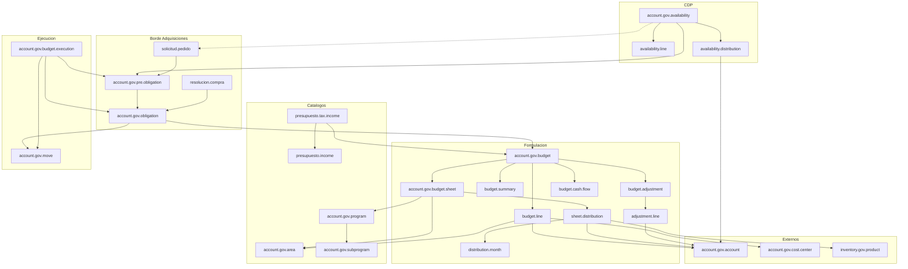
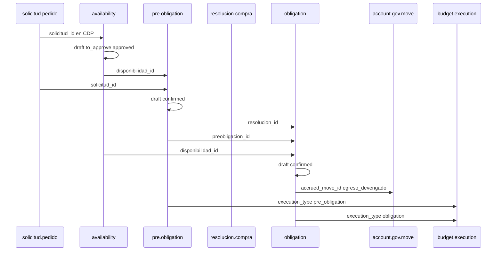

# Modelos Odoo — Presupuestos

**Fecha:** julio 2026  
**Alcance:** inventario as-is de modelos, relaciones y flujos de estado en Odoo. Sin mapeo a la arquitectura nueva.

## Fuentes y alcance

| Fuente | Ubicación | Rol |
|--------|-----------|-----|
| Código (fuente de verdad) | `sgm-template/addons/odoo_subdere/presupuesto_gov_cl` | App principal |
| Código (borde ejecución) | `sgm-template/addons/odoo_subdere/account_gov_adquisiciones` | CDP↔SOLPED, preobligación, obligación |
| Export BD (parcial / desfasado) | [`bd-export-odoo/modulos/presupuesto-gov-cl.md`](../../../bd-export-odoo/modulos/presupuesto-gov-cl.md) | Referencia tabular; ver § Notas |

**Incluye:** formulación anual, fichas, catálogos, modificaciones, CDP, preobligación/obligación (puente), ejecución presupuestaria y dependencias externas citadas.

**No incluye (o solo listado):** wizards transient, dashboard `presupuesto.gov.welcome`, informes CGR 1–4, reports SQL, dummies/legacy, detalle completo de Adquisiciones (SOLPED/resolución solo como bordes).

---

## Mapa de addons

| Addon | Rol |
|-------|-----|
| `presupuesto_gov_cl` | Presupuesto anual, fichas, CDP, ajustes, ejecución, catálogos, ingresos |
| `account_gov_adquisiciones` | Puente auto_install: extiende CDP con SOLPED; define preobligación y obligación |
| `account_gov_cl` | Cuentas presupuestarias (`account.gov.account`), centros de costo, asientos (`account.gov.move`) |
| `subdere_adquisiciones` | Consumidor del puente (`solicitud.pedido`, `resolucion.compra`) |
| `inventory_gov_cl` | Productos en distribución de fichas |
| `tupa` / `dms` | Expediente (`tupa.file`) y adjuntos (`dms.file`) en presupuesto y CDP |

Dependencias declaradas de `presupuesto_gov_cl`: `account_gov_cl`, `inventory_gov_cl`, `uom`.

---

## Diagrama de relaciones



---

## 1. Formulación

### `account.gov.budget` — Presupuesto anual

Cabecera del ciclo presupuestario municipal. Solo puede haber **un** presupuesto activo en `in_progress`.

| Campo / relación | Tipo | Notas |
|------------------|------|-------|
| `name` | Char (computed) | `Presupuesto {year}` |
| `year` | Integer | Año presupuestario |
| `approval_resolution` | Char | Resolución de aprobación |
| `state` | Selection | Ver § Flujos |
| `active` | Boolean | |
| `sheet_ids` | O2M → `budget.sheet` | Fichas (computed/store) |
| `line_ids` | O2M → `budget.line` | Líneas consolidadas |
| `summary_ids` | O2M → `budget.summary` | Resumen por cuenta 215 |
| `adjustment_ids` | O2M → `budget.adjustment` | Modificaciones |
| `income_line_ids` / `expense_line_ids` | O2M computed | Filtra líneas 115 / 215 |
| `total_income` / `total_expense` | Monetary | Coherencia ingresos/egresos |
| `currency_id` | M2O → `res.currency` | |
| `tupa_create_file_id` | M2O → `tupa.file` | Expediente de elaboración |
| `council_approval_document` | Binary | Obligatorio al aprobar desde `council` |

API útil: `get_active_budget()` → busca `state=in_progress` + `active`.

### `account.gov.budget.line` — Línea presupuestaria

Detalle por cuenta + área + centro de costo.

| Campo / relación | Tipo | Notas |
|------------------|------|-------|
| `budget_id` | M2O → budget | cascade |
| `account_id` | M2O → `account.gov.account` | Domínio 115% o 215% |
| `requested_amount` | Monetary | Solicitado |
| `approved_amount` | Monetary | Inicial aprobado |
| `current_amount` | Monetary | Vigente (con ajustes) |
| `area_id` | M2O → area | |
| `cost_center_id` | M2O → cost.center | |
| `adjustment_id` | M2O → adjustment | Última modificación que afectó la línea |
| `state` | related budget.state | |

### `account.gov.budget.summary` — Resumen por cuenta

Consolidado por cuenta de egreso (215). Campos monetarios análogos a la línea (`requested` / `approved` / `current`) + `adjustment_id`.

### `account.gov.budget.sheet` — Ficha presupuestaria

Unidad de formulación por dirección/departamento (o ingresos / personal).

| Campo / relación | Tipo | Notas |
|------------------|------|-------|
| `sheet_type` | Selection | `departmental` / `income` / `staff` |
| `name` | Char | Correlativo |
| `budget_id` | M2O → budget | Default: presupuesto activo |
| `program_id` / `subprogram_id` | M2O | Clasificación funcional |
| `direction_id` / `department_id` / `unit_id` | M2O → `hr.department` | Jerarquía org |
| `unidad_ejecutora_id` | M2O → area | |
| `responsible_id` | M2O → `res.users` | |
| `municipal_contribution` | Selection | `no_aplica` / `estudios_basicos` / `proyectos` |
| `tipo_financiamiento` | Selection | 0 Institucional … 3 Mixto |
| `codigo_ini` / `codigo_unico_proyecto` | Char | Iniciativas de inversión |
| `monto_total` / `approved_amount` | Monetary | Solicitado / aprobado |
| `distribution_line_ids` | O2M → sheet.distribution | Tipo departmental |
| `income_line_ids` | O2M → sheet.income.line | Tipo income |
| `staff_line_ids` | O2M → sheet.staff.line | Tipo staff |
| `goal_ids` / `request_ids` | O2M | Objetivos / solicitudes |
| `month_amount_ids` | O2M computed → sheet.month | Totales mensuales |
| `state` | Selection | Ver § Flujos |

### Distribución y detalle mensual (ficha)

| `_name` | Rol | Relaciones clave |
|---------|-----|------------------|
| `account.gov.budget.sheet.distribution` | Ítem de gasto (bien/servicio) | M2O sheet, product (`inventory.gov.product`), account 215, area, cost_center; O2M months |
| `account.gov.budget.sheet.distribution.month` | Monto por mes | M2O distribution; `month` Selection 01–12; `amount` |
| `account.gov.budget.sheet.income.line` | Línea de ingresos | M2O sheet, account 115; O2M months |
| `account.gov.budget.sheet.income.month` | Mes ingreso | M2O income.line |
| `account.gov.budget.sheet.staff.line` | Línea de personal | M2O sheet, account, area, cost_center; O2M months |
| `account.gov.budget.sheet.staff.month` | Mes personal | M2O staff.line |
| `account.gov.budget.sheet.month` | Totales mensuales de ficha | M2O sheet (computed) |
| `account.gov.budget.sheet.goal` | Objetivo | `goal`, indicador, % cumplimiento |
| `account.gov.budget.sheet.request` | Solicitud de monto | account + amount + reason |

Campos relevantes de distribución: `unit_price`, `quantity`, `total` (computed), `acquisition_mechanism` (`compra_agil`, `convenio_marco`, `licitacion_publica`, `trato_directo`, …), `approximate_date`, `gasto_funcionamiento`, `is_correctly_distributed` (suma meses = total).

### `account.gov.budget.cash.flow` — Flujo de caja

Vista mensual agregada por presupuesto. `line_type`: `income` (115) / `expense` (215) / `balance`. Montos enero–diciembre computed desde fichas.

---

## 2. Catálogos

| `_name` | Campos clave | Relaciones |
|---------|--------------|------------|
| `account.gov.area` | `code` (unique), `name`, `description` | Usado como área de gestión / unidad ejecutora |
| `account.gov.program` | `code`, `name` | M2O `hr.department`; O2M `subprogram` |
| `account.gov.subprogram` | `code`, `name` | M2O → program |
| `presupuesto.income` | `code` (unique), `name`, `active` | Catálogo de impuestos/fuentes |
| `account.gov.income.type` | `code`, `name`, `active` | Tipo de ingreso (catálogo auxiliar) |
| `presupuesto.tax.income` | `type` municipal/fiscal/otro; flags enrolado / caja / web | M2O income, department (unidad giradora), budget; O2M accounts |
| `presupuesto.tax.income.account` | `value` | M2O tax.income, account, area |

---

## 3. Modificaciones

### `account.gov.budget.adjustment`

| Campo / relación | Tipo | Notas |
|------------------|------|-------|
| `budget_id` | M2O | Solo budgets `approved` o `in_progress` |
| `adjustment_type` | Selection | `ajuste` / `reasignacion` / `saldo_apertura` |
| `adjustment_resolution` / `adjustment_date` | Char / Date | |
| `parent_account_id` | M2O account | Requerido en reasignaciones (cuenta padre) |
| `reason` | Text | |
| `state` | Selection | `draft` → `approved` |
| `active` | Boolean | Archivar deshace efecto |
| `line_ids` | O2M → adjustment.line | |
| `total_amount` | Monetary | En reasignaciones debe cuadrar (neto 0) |

### `account.gov.budget.adjustment.line`

Imputación: `account_id`, `area_id` (required), `cost_center_id`; montos `incremento` / `descuento` / `monto_nuevo` / `amount`. Guarda snapshots (`original_budget_*`) para reversión al archivar.

---

## 4. CDP — Certificado de disponibilidad

### `account.gov.availability`

Vive en `presupuesto_gov_cl`. El puente `account_gov_adquisiciones` **extiende** el modelo con `solicitud_id` y `preobligacion_id`.

| Campo / relación | Tipo | Notas |
|------------------|------|-------|
| `name` | Char | Correlativo (secuencia) |
| `date` / `year` | Date / Integer | |
| `description` | Text | Glosa |
| `amount` | Monetary | Suma de `line_ids.subtotal` |
| `monto_original` | Monetary | Congelado al autorizar |
| `line_ids` | O2M → availability.line | Bienes/servicios |
| `line_distribution_ids` | O2M → availability.distribution | Imputación presupuestaria |
| `attachment_ids` | M2M → `dms.file` | |
| `procedure_id` | M2O → `tupa.file` | |
| `approved_user_id` / `approved_date` | | Autorización |
| `state` | Selection | Ver § Flujos |
| `solicitud_id` | M2O → solicitud.pedido | **Solo en puente** |
| `preobligacion_id` | M2O → pre.obligation | **Solo en puente** |

Regla: suma de distribuciones = `amount` antes de enviar a autorización.

### `account.gov.availability.line`

Detalle operativo: `cantidad`, `uom_id`, `descripcion`, `precio_unitario`, `subtotal` (computed).

### `account.gov.availability.distribution`

Imputación: `account_id` (215%), `area_id` (required), `cost_center_id`, `program_id`, `subprogram_id`, `amount`, `monto_original`.

---

## 5. Ejecución / compromiso (borde Adquisiciones)

Modelos definidos en **`account_gov_adquisiciones`** (no en `presupuesto_gov_cl`).

### Secuencia CDP → preobligación → obligación



### `account.gov.pre.obligation`

| Campo / relación | Tipo | Notas |
|------------------|------|-------|
| `name` | Char | `5-{sequence:04d}` |
| `date` / `amount` | | `amount` = suma distribuciones |
| `solicitud_id` | M2O → solicitud.pedido | |
| `disponibilidad_id` | M2O → availability | |
| `obligacion_acumulada` / `saldo` | Float | Saldo vs obligaciones de la SOLPED |
| `line_distribution_ids` | O2M → pre.obligation.distribution | |
| `state` | Selection | `draft` / `confirmed` / `cancelled` |

Distribución: misma tipología que CDP (`account` 215, `area`, `cost_center`, `program`, `subprogram`, `amount`).

Modelo auxiliar `account.gov.obligation.simple`: sombra para cálculo de saldo (no es el flujo principal).

### `account.gov.obligation`

| Campo / relación | Tipo | Notas |
|------------------|------|-------|
| `name` | Char | `8-{sequence:04d}` |
| `amount` | Monetary | |
| `resolucion_id` | M2O → resolucion.compra | |
| `preobligacion_id` | M2O → pre.obligation | |
| `disponibilidad_id` | M2O → availability | |
| `budget_id` | M2O → budget | Default: presupuesto activo |
| `partner_id` | M2O → `res.partner` | Proveedor |
| `order_number` / `ref` | Char | OC / documento |
| `accrued_move_id` / `trasp_move_id` | M2O → `account.gov.move` | Devengado / traspaso |
| `line_distribution_ids` | O2M → obligation.distribution | |
| `state` | Selection | `draft` / `confirmed` / `cancelled` |

Al confirmar puede generar egreso devengado (`action_create_accrued_expense`). Valida saldo de egreso en cuenta (`expense_balance`).

---

## 6. Ejecución presupuestaria y reportes

### `account.gov.budget.execution`

Registro de avance ligado a preobligación u obligación.

| Campo / relación | Tipo | Notas |
|------------------|------|-------|
| `name` | Char | Prefijos 06-/08-/22- según tipo |
| `execution_type` | Selection | `pre_obligation` / `obligation` |
| `pre_obligation_id` / `obligation_id` | M2O | |
| `partner_id` | M2O partner | Beneficiario |
| `account_move_id` | M2O → move | |
| `movement_type_id` | M2O → movement.type | |
| `line_ids` | O2M → execution.line | |
| `state` | Selection | `draft` / `confirmed` / `cancelled` |

Líneas: `account_id`, `area_id`, `cost_center_id`, `amount`, montos de pre/obligación.

**Nota:** el export BD describe un modelo de ejecución “por período/cuenta” distinto al implementado en código (cabecera + líneas ligadas a pre/obligación). Prevalece el código.

### Reportes e informes (listado)

| `_name` / artefacto | Addon | Nota |
|---------------------|-------|------|
| `report.budget.summary` / `report.budget.execution` | presupuesto_gov_cl | Transient / reportes |
| `account.gov.contraloria.informe{1..4}` | presupuesto_gov_cl | Informes CGR |
| `report.budget.sheet.distribution` | account_gov_adquisiciones | Report SQL |
| `presupuesto.gov.welcome` | presupuesto_gov_cl | Dashboard UI |

---

## 7. Dependencias externas

| Modelo externo | Addon | Uso en Presupuesto |
|----------------|-------|--------------------|
| `account.gov.account` | account_gov_cl | Cuenta presupuestaria (115 ingresos / 215 egresos); saldos |
| `account.gov.cost.center` | account_gov_cl | Imputación en líneas y distribuciones |
| `account.gov.move` / `.line` | account_gov_cl | Devengados desde obligación; líneas extendidas con `area_id`, `program_id`, `subprogram_id` (`account_gov_move_line.py`) |
| `account.gov.movement.type` | account_gov_cl | Tipo de movimiento en ejecución |
| `inventory.gov.product` | inventory_gov_cl | Spec del bien en sheet.distribution |
| `hr.department` | HR | Dirección / depto / unidad en ficha; unidad giradora |
| `tupa.file` | tupa | Expediente de elaboración / CDP |
| `dms.file` | dms | Adjuntos del CDP |
| `adquisiciones.solicitud.pedido` | subdere_adquisiciones | Borde SOLPED |
| `adquisiciones.resolucion.compra` | subdere_adquisiciones | Borde OC / resolución |

**Inherit** adicionales en presupuesto: `hr.department`, `res.company`, `tupa.procedure`, `report.account.execution`.

**Wizards** (no documentados en detalle): `account.gov.budget.review.wizard`, `account.gov.budget.department.wizard`, `account.gov.income.import.wizard`.

---

## Flujos de estado

### Presupuesto anual (`account.gov.budget`)

```
draft → review → council → approved → in_progress → completed
```

- Un solo `in_progress` activo a la vez.
- Documento de concejo obligatorio al salir de `council`.

### Ficha (`account.gov.budget.sheet`)

```
draft → in_review → reviewed
                 ↘ rejected
```

### CDP (`account.gov.availability`)

```
draft → to_approve → approved
                  ↘ rejected
```

- Desde `rejected` / `to_approve` se puede volver a `draft` (no desde `approved`).

### Modificación (`account.gov.budget.adjustment`)

```
draft → approved
```

### Preobligación / obligación / ejecución

```
draft → confirmed
     ↘ cancelled
```

(También `action_draft` para volver a borrador en preobligación y ejecución.)

---

## Notas — desfasajes vs bd-export

El export [`presupuesto-gov-cl.md`](../../../bd-export-odoo/modulos/presupuesto-gov-cl.md) está **incompleto y desactualizado** respecto al código:

| Tema | Export BD | Código (fuente de verdad) |
|------|-----------|---------------------------|
| Estados presupuesto | `draft / approved / in_progress / closed` | `draft → review → council → approved → in_progress → completed` |
| Estados CDP | `draft / confirmed / used / expired` | `draft → to_approve → approved / rejected` |
| Fichas y distribución mensual | Ausentes o parciales | Familia completa `budget.sheet*` |
| Preobligación / obligación | No en este export | Viven en `account_gov_adquisiciones` |
| Ejecución | Modelo “período + montos” | Cabecera ligada a pre/obligación + líneas |
| CDP campos | `account_id` / `area_id` en cabecera | Imputación en `availability.distribution`; cabecera con líneas de bienes |

Al diseñar el dominio nuevo, no tomar el export como contrato de campos sin contrastar el ORM.
)
