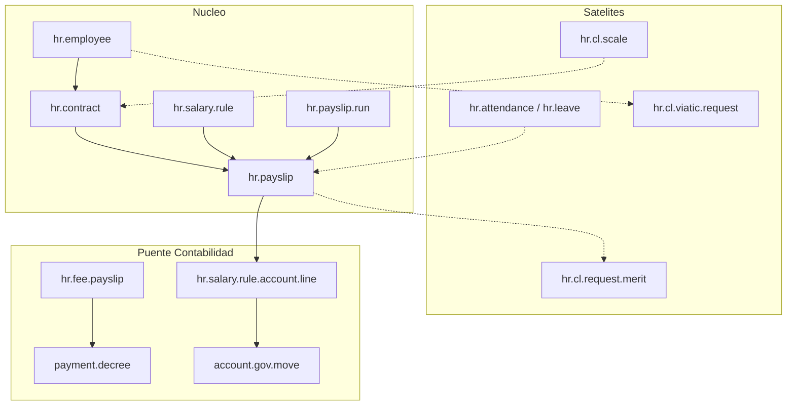

# Modelos Odoo — RRHH / Remuneraciones

**Fecha:** julio 2026  
**Alcance:** inventario as-is de modelos, relaciones y flujos de estado en Odoo. Sin mapeo a la arquitectura nueva.

## Fuentes y alcance

| Fuente | Ubicación | Rol |
|--------|-----------|-----|
| Código (app municipal) | `sgm-template/addons/odoo_subdere/tupa_hr` | App «Gestión Municipal: RRHH» |
| Código (nómina Chile) | `…/l10n_cl_hr` | App «Chile Payroll» |
| Código (motor) | `…/bi_hr_payroll` | Estructura / regla / payslip / run |
| Código (escala) | `…/l10n_cl_hr_scale` | Escala única, grados, catálogos planta |
| Código (asistencia) | `…/l10n_cl_holidays_attendance` | HE, licencias, ISAPRE, subrogación |
| Código (méritos) | `…/l10n_cl_hr_merit_demerit` | Méritos / deméritos |
| Código (viáticos) | `…/l10n_cl_viatic` | Cometido / comisión / viáticos |
| Código (puente contable) | `…/account_hr_gov_cl` | Nómina/honorarios → move + decreto |
| Código (portal / autoservicio) | `…/employee_portal`, `…/autoservicio_gov_cl` | Mural / menús autoservicio |
| Código (cursos / feriados) | `…/hr_course`, `…/hr_holidays_public` | Capacitaciones; feriados públicos |
| Código (LRE) | `…/l10n_cl_hr_lre` | Solo wizard CSV (sin modelos de dominio) |
| Export BD (parcial / desfasado) | [`l10n-cl-hr.md`](../../../bd-export-odoo/modulos/l10n-cl-hr.md), [`l10n-cl-hr-merit-demerit.md`](../../../bd-export-odoo/modulos/l10n-cl-hr-merit-demerit.md), [`l10n-cl-holidays-attendance.md`](../../../bd-export-odoo/modulos/l10n-cl-holidays-attendance.md), [`l10n-cl-viatic.md`](../../../bd-export-odoo/modulos/l10n-cl-viatic.md), [`employee-portal.md`](../../../bd-export-odoo/modulos/employee-portal.md) | Referencia tabular; ver § Notas |
| Inventario Contabilidad (borde) | [`../contabilidad/modelos-odoo.md`](../contabilidad/modelos-odoo.md) §9 | Detalle de asiento / decreto desde nómina |
| Inventario Tesorería (borde) | [`../tesoreria/modelos-odoo.md`](../tesoreria/modelos-odoo.md) | Consumo de `payment.decree` |

**Incluye:** empleado/contrato/previsión, escala y calidad jurídica, nómina y liquidaciones municipales, asistencia/licencias/HE, evaluación y méritos, viáticos, reclutamiento/beneficios, puente RRHH→Contabilidad/Tesorería (borde), portal/autoservicio, nota LRE.

**No incluye (o solo listado):** wizards transient en profundidad; reports SQL/xlsx; detalle BPMN TUPA; detalle de `account.gov.move` / `payment.decree` (dueños Contabilidad / Tesorería).

**Regla:** código ORM = fuente de verdad; exports BD como referencia desfasada.

---

## Mapa de addons

| Addon | Rol | `application` | depends (declarados) | hooks |
|-------|-----|---------------|----------------------|-------|
| `tupa_hr` | App municipal RRHH: contratos planta/contrata, suplementarias, DJ1887, banco, PMG, reclutamiento, TUPA | True | `tupa`, `account_gov_cl`, `hr_course`, `hr_contract`, `bi_hr_payroll`, `l10n_cl_hr`, `l10n_cl_hr_scale`, `l10n_cl_viatic`, `l10n_cl_holidays_attendance` | `post_init_hook`: `_tupa_hr_post_init` |
| `l10n_cl_hr` | Chile Payroll: previsión, indicadores, evaluación | True | `bi_hr_payroll`, `hr_contract`, `hr_work_entry_contract`, `l10n_cl_hr_scale` | `post_init_hook` |
| `bi_hr_payroll` | Motor Community: structure/rule/payslip/run | (auto) | `hr_contract`, `hr_holidays` | — |
| `l10n_cl_hr_scale` | Escala única + catálogos (grado, ley, estamento, …) | True | `bi_hr_payroll`, `report_xlsx` | — |
| `l10n_cl_holidays_attendance` | Asistencia, HE, licencias ISAPRE, subrogación | True | `bi_hr_payroll`, `hr_attendance`, `hr_holidays_public`, `hr_holidays_attendance`, `l10n_cl_hr_scale`, `l10n_cl_hr`, `report_xlsx` | `pre_init_hook` |
| `l10n_cl_hr_merit_demerit` | Anotaciones mérito / demérito | False | `hr` | — |
| `l10n_cl_viatic` | Viáticos / cometido / comisión | False | `l10n_cl_hr_scale` | — |
| `account_hr_gov_cl` | Mapeo contable nómina + honorarios + Previred | True | `account_gov_cl`, `tesoreria_gov_cl`, `l10n_cl_hr`, `tupa_hr` | `_tupa_account_hr_post_init` |
| `employee_portal` | Mural / banners portal empleado | True | `base`, `hr` | — |
| `autoservicio_gov_cl` | Menús/vistas autoservicio (sin modelos propios) | — | `l10n_cl_hr`, `l10n_cl_holidays_attendance`, `l10n_cl_viatic` | — |
| `hr_course` | Capacitaciones | — | `hr_attendance`, `mail` | — |
| `hr_holidays_public` | Feriados públicos (OCA) | — | `hr_holidays` | — |
| `l10n_cl_hr_lre` | Export CSV LRE | False | `l10n_cl_hr` | — |

**Nota:** `l10n_cl_hr_merit_demerit` no está en `depends` de `tupa_hr`; opera como satélite instalable aparte.

---

## Diagrama de relaciones



---

## 1. Empleado, contrato, previsión

### `hr.employee` (inherits)

Extensiones relevantes:

| Addon | Aportes |
|-------|---------|
| `l10n_cl_hr` | `type_id` → `hr.type.employee`; `hr.employee.input` (inputs permanentes) |
| `tupa_hr` | beneficios, estudios, familiares, teletrabajo, historial depto, banco gov, TUPA, dirección/unidad |
| `l10n_cl_holidays_attendance` | campos de asistencia/HE |
| `l10n_cl_hr_merit_demerit` | vínculo a solicitudes |
| `hr_course` | cursos del empleado |

Modelos satélite empleado (`tupa_hr`):

| `_name` | Rol |
|---------|-----|
| `hr.cl.benefits` / `hr.cl.benefits.employee` | Catálogo y asignación de beneficios |
| `hr.cl.employee.study` | Estudios |
| `hr.cl.employee.relative` | Cargas / familiares |
| `hr.employee.telework` | Teletrabajo |
| `hr.department.history` | Historial de departamento |
| `hr.external.salary` | Remuneraciones externas |
| `hr.zone.assignment` / `hr.extreme.zone.assignment` | Zona / zona extrema |
| `hr.judge.evaluation` | Evaluación juez (caso puntual) |

### `hr.contract` (inherits)

| Addon | Campos / relaciones clave |
|-------|---------------------------|
| `bi_hr_payroll` | `struct_id` → `hr.payroll.structure`; `schedule_pay`; `hr.contract.advantage.template` |
| `l10n_cl_hr` | `afp_id`, `isapre_id`, cotización UF/FUN, `prevision_ids` (APV), mutual, cargas, colación/movilización, tipo contrato CL |
| `l10n_cl_hr_scale` | `gov_statement_id`, `gov_statement_dipres_id`, `gov_grade_id` → `hr.cl.grade` |
| `tupa_hr` | `gov_calidad_juridica_id` → `hr.calidad.juridica`; dirección/unidad; bienios; caja/movilidad; `ex_caja_id`; `worker_type` (DJ1887); `tupa_create_file_id`; renovación |

### Catálogos de previsión (`l10n_cl_hr`)

| `_name` | Rol |
|---------|-----|
| `hr.afp` | AFP (`codigo`, `rate`, `sis`, `partner_id`) |
| `hr.isapre` | Isapre / salud |
| `hr.ccaf` | CCAF |
| `hr.mutual` | Mutualidad |
| `hr.apv` | Institución APV |
| `hr.contract.prevision` | Líneas APV del contrato (moneda UF/CLP, forma pago, régimen A/B) |
| `hr.seguro.complementario` | Seguro complementario |
| `hr.type.employee` | Tipo de empleado |
| `hr.employee.termination` | Término: `draft` → `confirmed`; motivo `renuncia` / `otro` |
| `hr.l10n_cl_hr.indicator` | Indicadores mensuales (UF, etc.): `draft` / `done` |

---

## 2. Escala / planta / calidad jurídica

### Núcleo escala (`l10n_cl_hr_scale`)

| `_name` | Rol |
|---------|-----|
| `hr.cl.scale` | Escala de sueldos + factores de bienios; O2M líneas, caja, movilidad |
| `hr.cl.scale.lines` | Línea grado × monto |
| `hr.cl.scale.caja.assignment` / `hr.cl.scale.movilidad.assignment` | Asignaciones por categoría 1–3 |
| `hr.cl.grade` | Grado |
| `hr.cl.statement` / `hr.cl.statement.dipres` | Estamento / estamento DIPRES |
| `hr.cl.law` | Ley aplicable |
| `hr.cl.legal.quality` | Calidad jurídica (catálogo escala; distinto de `hr.calidad.juridica`) |
| `hr.cl.budget.allocation` | Asignación presupuestaria |
| `hr.cl.functional.units` | Unidades funcionales |
| `hr.cl.extra.hours` / `hr.cl.medical.licenses` | Catálogos HE / licencias médicas |
| Otros catálogos | provincia/comuna CL, especialidades, knowledge, qualification.type, reason.estrangement, performance.quality/institution, finance.expenses |

### Calidad jurídica municipal (`tupa_hr`)

### `hr.calidad.juridica`

Tabla DIPRES usada en contrato y en mapeo contable: `code`, `name`, `active`. Unique `code`. Seed en data del addon.

**Doble vía:** `hr.cl.legal.quality` (escala) vs `hr.calidad.juridica` (nómina/contabilidad municipal). El puente `account_hr_gov_cl` usa `hr.calidad.juridica`.

---

## 3. Nómina y liquidaciones

### Motor (`bi_hr_payroll`)

| `_name` | Rol / estados |
|---------|----------------|
| `hr.payroll.structure` | Estructura salarial; O2M reglas |
| `hr.salary.rule` / `hr.salary.rule.category` | Reglas (`condition_select`, `amount_select`) |
| `hr.rule.input` | Tipos de input |
| `hr.contribution.register` | Registro de cotizaciones |
| `hr.payslip` | Liquidación: `draft` → `verify` → `done` / `cancel` |
| `hr.payslip.line` / `worked_days` / `input` | Detalle |
| `hr.payslip.run` | Lote: `draft` / `close` |

### Extensiones Chile / municipal

| Origen | Aporte |
|--------|--------|
| `l10n_cl_hr` | Indicadores en payslip; ajustes de regla |
| `tupa_hr` | `supplementary_id`; inputs retroactivos / merge days; vínculo indicador/escala; `tupa_file_id` en run |
| `l10n_cl_holidays_attendance` | `hr.payslip.extra.hours`; wizards ausencia/HE/ISAPRE en liquidación |
| `account_hr_gov_cl` | Asiento + decretos + Previred en run (ver §8) |

### Modelos operativos `tupa_hr`

| `_name` | Estados | Notas |
|---------|---------|-------|
| `hr.payroll.supplementary` | `draft` → `computed` → `confirmed` / `cancelled` | Reliquidación; líneas + resumen; M2O `payslip_run_id` |
| `hr.bank.transfer.file` | `draft` → `review` → `generated` | Archivo bancario del run; líneas por empleado/payslip; `gov_bank_id` |
| `hr.dj1887` | `draft` → `computed` → `generated` → `sent` / `cancelled` | Declaración jurada 1887 |
| `hr.cl.pmg` | `draft` → `open` → `done` | Programa de mejoramiento de gestión; niveles 1–3 |
| `hr.honorarium.certificate` | `draft` / `generated` | Certificado honorarios |
| `hr.input.import.history` | — | Historial importación de inputs |
| `tupa.monetary_correction` | — | Corrección monetaria (cron) |

Wizards (solo listado): `wizard.hr.input.import`, `hr.contract.mass.renewal.wizard`, `tupa.import.employees` / `departments`, reportes bienios/INE/transparencia, import candidatos.

---

## 4. Asistencia, licencias, horas extra

Addon ancla: `l10n_cl_holidays_attendance` (+ `hr_holidays_public` para feriados).

| `_name` | Estados | Rol |
|---------|---------|-----|
| `hr.attendance` (inherit) | — | Marcas; vínculo overtime |
| `hr.attendance.excuse` | — | Justificación de inasistencia |
| `hr.attendance.remote` | — | Asistencia remota |
| `hr.attendance.overtime` | — | Overtime base |
| `hr.cl.employee.extra` | `draft` → `validated` | Saldo HE (25%/50%); O2M `used_ids` |
| `hr.cl.employee.extra.used` | — | Uso descontado a payslip/leave |
| `hr.cl.overtime.resolution` | `draft` → `waiting` → `active` → `expired` | Resolución que autoriza HE; líneas por empleado |
| `hr.leave` (inherit) | (estados core Odoo) | Extensiones: ISAPRE, maternidad gov, compensados, substitute |
| `hr.leave.compensate` | — | Día compensado |
| `hr.leave.isapre` | `pending` → `sended` → `approved` / `rejected` / `reduced` / `increased` | Pago licencia a Isapre/Fonasa; tipo enfermedad/maternidad; datos SIAPER |
| `hr.holiday.request` | `draft` → `approved` / `rejected` | Solicitud de feriado |
| `hr.subrogation` | `draft` → `registered` / `cancelled` | Subrogación durante licencia |
| `hr.holidays.public` / `.line` | — | Feriados públicos por año |

Wizards (listado): excuse, payslip absence/extra/isapre, SIAPER medical/permits, isapre increase/reduce/reject, subrogation report.

---

## 5. Evaluación / méritos-deméritos

### Evaluación del desempeño (`l10n_cl_hr`)

| `_name` | Rol |
|---------|-----|
| `hr.cl.performance.evaluation` | Evaluación; etapas vía `stage_id` → `hr.cl.performance.evaluation.type` (no Selection `state`); factores skills/behavior/direction; listas 1–4 |
| `hr.cl.performance.factor.lines` (+ skills/behavior/direction) | Líneas de factores (escala 1–7) |
| `hr.cl.factor.type` / `hr.cl.factor.letral` | Catálogo de factores |
| `hr.cl.qualification.record` | Hoja de calificación: `draft` → `waiting` → `with_discharge` → `completed` |

### Méritos / deméritos (`l10n_cl_hr_merit_demerit`)

### `hr.cl.request.merit`

| Campo | Notas |
|-------|-------|
| `state` | `draft` → `in_progress` → `done` / `cancel` |
| `request_employee_id` / `employee_id` / `responsible_employee_id` | Solicitante / afectado / aprobador |
| `code` | Secuencia al pasar a `in_progress` |
| Fechas | `date`, `date_notify`, `date_review`; auto-done por cron si vence revisión |

### `hr.cl.request.demerit`

| Campo | Notas |
|-------|-------|
| `state` | `draft` → `in_progress` → `in_review` → `done` / `cancel` |
| Flujo extra | Empleado puede pedir revisión (`in_review`); auto-aceptación si vence plazo |

Wizards: `hr.cl.merit.request.wizard`, `hr.cl.dmerit.review.wizard`.

---

## 6. Viáticos

Addon: `l10n_cl_viatic` (extends request en `tupa_hr` para vistas/TUPA).

| `_name` | Estados | Rol |
|---------|---------|-----|
| `hr.cl.viatic.config` | `draft` → `done` / `cancel` | Config nacional/internacional |
| `hr.cl.viatic.config.scale` / `.item` / `.basic.amount` | — | Escalas y montos por grado |
| `hr.cl.viatic.percentage.type` | — | Tipos de porcentaje |
| `hr.cl.cost.of.living.ratio` / `.line` | — | Factores costo de vida por zona |
| `hr.cl.viatic.request` | `draft` → `requested` → `confirmed` / `rejected` | Solicitud; tipo nacional/internacional; cometido/comisión; líneas e ítems |
| `hr.cl.viatic.request.line` / `.line.item` | — | Detalle del viaje |
| `hr.cl.viatic.response` | `draft` → `requested` → `confirmed` / `rejected` | Respuesta / rendición |

---

## 7. Reclutamiento y beneficios municipales

### `hr.gov.recruitment` (`tupa_hr`)

| Campo | Notas |
|-------|-------|
| `state` | `borrador` → `publicacion` → `seleccion` → `finalizado` |
| Grado / depto | `grado_id`, `direccion_id`, `unidad_id`, `departamento_id` |
| `tupa_create_file_id` | Expediente TUPA |
| `candidate_ids` | O2M → `hr.gov.recruitment.candidate` |

### `hr.gov.recruitment.candidate`

`state`: `postulado` → `en_revision` → `elegido` / `rechazado`; `candidate_response`: `pendiente` / `aceptado` / `rechazado`; puede materializar `employee_id` / `contract_id`.

### Otros (`tupa_hr` + `hr_course`)

| `_name` | Rol |
|---------|-----|
| `hr.cl.benefits*` | Beneficios municipales |
| `hr.zone.assignment` / `hr.extreme.zone.assignment` | Asignación de zona |
| `hr.employee.telework` | Teletrabajo |
| `hr.course` / `hr.course.schedule` / attendee / attendance | Capacitaciones; schedule: `draft` → `waiting_attendees` → `in_progress` → `in_validation` → `completed` / `cancelled` |
| `hr.ine.occupational.group` | Clasificación INE |
| `hr.gratification.parameter` | Parámetros gratificación |
| `hr.ex.caja` | Ex caja previsional |

Procedimientos TUPA seed (`tupa_hr`): planta, contrata, honorarios (con/sin suma), desvinculación, renuncia, cometido, etc. (BPMN fuera de alcance de este inventario).

---

## 8. Puente RRHH → Contabilidad / Tesorería

Addon: `account_hr_gov_cl`. **Detalle de asientos y decretos:** [`../contabilidad/modelos-odoo.md`](../contabilidad/modelos-odoo.md) §9. Aquí solo el borde disparador.

| Modelo | Qué dispara |
|--------|-------------|
| `hr.salary.rule.account.line` | Mapeo `salary_rule_id` × `calidad_juridica_id` → `account_debit_id` / `account_credit_id` (`account.gov.account`). Unique (regla, calidad) |
| `account.gov.payment.group` | Agrupa decretos de nómina (Principal, Previsión, …); cuenta con `payment_group_id` |
| `hr.payslip.run` (inherit) | `action_generate_accounting_entry` → `accounting_move_id` (EG_DEV); al confirmar → `action_create_payment_decrees`; Previred (`previred_line_ids`, archivo TUPA) |
| `hr.fee.payslip.run` / `hr.fee.payslip` | Lote honorarios: `draft` / `close`; `accounting_move_id`, `payment_decree_id`, `tupa_file_id` |
| `hr.payroll.approval.control` | `draft` → `generated` → `archived` (control/reporte; **no** genera move) |
| `hr.payslip.previred.line` | Totales Previred del run |
| `hr.leave.isapre` (inherit) | Puede vincular `gov_entry_order_id` / `gov_payment_id` (ingreso percibido) |

Frontera Tesorería: los `payment.decree` generados se pagan/visan en Tesorería; este módulo no modela caja diaria.

---

## 9. Portal / autoservicio

| Addon | Modelos | Notas |
|-------|---------|-------|
| `employee_portal` | `employee.portal.wall.post` (`draft` / `published` / `archived`); `employee.portal.banner`; `employee.portal.wall.post.template` | Mural interno; cron cumpleaños |
| `autoservicio_gov_cl` | *(ninguno)* | Solo vistas/menús sobre payslip, leave, attendance, evaluación, viáticos |

---

## 10. LRE

`l10n_cl_hr_lre`: único artefacto `wizard.export.csv.lre` (export CSV; depende de indicadores `hr.l10n_cl_hr.indicator`). **Sin modelos de dominio persistentes.**

---

## Flujos de estado

### Liquidación / lote

```
hr.payslip:     draft → verify → done
                              ↘ cancel
hr.payslip.run: draft → close
```

### Suplementaria / DJ1887 / banco / PMG

```
supplementary: draft → computed → confirmed
                                ↘ cancelled
dj1887:        draft → computed → generated → sent
                                           ↘ cancelled
bank.transfer: draft → review → generated
pmg:           draft → open → done
```

### Asistencia / licencias / HE

```
employee.extra:        draft → validated
overtime.resolution:   draft → waiting → active → expired
leave.isapre:          pending → sended → approved | rejected | reduced | increased
holiday.request:       draft → approved | rejected
subrogation:           draft → registered | cancelled
```

### Viáticos

```
viatic.config:   draft → done | cancel
viatic.request:  draft → requested → confirmed | rejected
viatic.response: draft → requested → confirmed | rejected
```

### Méritos / deméritos / calificación

```
merit:               draft → in_progress → done | cancel
demerit:             draft → in_progress → in_review → done | cancel
qualification.record: draft → waiting → with_discharge → completed
```

### Honorarios / reclutamiento / portal / cursos

```
fee.payslip.run:     draft → close
recruitment:         borrador → publicacion → seleccion → finalizado
candidate:           postulado → en_revision → elegido | rechazado
wall.post:           draft → published → archived
course.schedule:     draft → waiting_attendees → in_progress → in_validation → completed
                                                                  ↘ cancelled
payroll.approval:    draft → generated → archived
```

### Cadena puente (resumen)

```
hr.payslip.run (close + reglas mapeadas)
  → account.gov.move (EG_DEV)
  → payment.decree (por payment.group)
  → (Tesorería: approved → paid → EG_PAG)
```

---

## Notas — desfasajes vs bd-export

Los exports bajo `bd-export-odoo/modulos/` están **incompletos y desalineados** respecto al ORM. El export etiquetado `l10n-cl-hr` cubre poco (p. ej. horas extra que en código viven en `l10n_cl_holidays_attendance`) frente al volumen real del stack.

| Tema | Export BD | Código (fuente de verdad) |
|------|-----------|---------------------------|
| Cobertura `l10n-cl-hr.md` | sobre todo `hr.cl.employee.extra*` | Esos modelos están en `l10n_cl_holidays_attendance`; `l10n_cl_hr` aporta AFP/Isapre/contrato/evaluación/indicadores, etc. |
| Méritos `_name` | `hr.request.merit` / `hr.request.demerit` | `hr.cl.request.merit` / `hr.cl.request.demerit` |
| Mérito `state` | `draft` / `submitted` / `approved` / `rejected` | `draft` / `in_progress` / `done` / `cancel` |
| Demérito `state` | igual que mérito (+ severity) | incluye `in_review`; sin campo `severity` en ORM |
| Viático `_name` | `hr.viatic.request`, `hr.cost.of.living`, `hr.viatic.config` | `hr.cl.viatic.request`, `hr.cl.cost.of.living.ratio*`, `hr.cl.viatic.config*` |
| Viático `state` | `draft` / `approved` / `paid` / `rejected` | `draft` / `requested` / `confirmed` / `rejected` |
| Portal wall | `body`, `date_published`, `date_expiry`, M2M depto | `body_html`, `published_date`, `archived_planned_date`; sin M2M depto en el modelo leído |
| Faltan en exports | — | `tupa_hr` casi completo (supplementary, DJ1887, recruitment, bank transfer, calidad jurídica…); `bi_hr_payroll`; `account_hr_gov_cl`; escala; LRE wizard |

Al diseñar el dominio nuevo, no tomar el export como contrato de campos sin contrastar el ORM.
