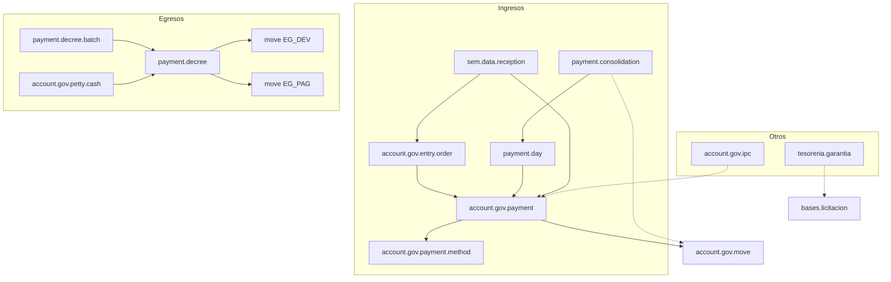

# Modelos Odoo — Tesorería

**Fecha:** julio 2026  
**Alcance:** inventario as-is de modelos, relaciones y flujos de estado en Odoo. Sin mapeo a la arquitectura nueva.

## Fuentes y alcance

| Fuente | Ubicación | Rol |
|--------|-----------|-----|
| Código (núcleo) | `sgm-template/addons/odoo_subdere/tesoreria_gov_cl` | App Tesorería Municipal |
| Código (portal) | `…/portal_tesoreria_gov_cl` | Consulta proveedores (borde) |
| Export BD (parcial / desfasado) | [`bd-export-odoo/modulos/tesoreria-gov-cl.md`](../../../bd-export-odoo/modulos/tesoreria-gov-cl.md) | Referencia tabular; ver § Notas |
| Inventario Contabilidad (borde) | [`../contabilidad/modelos-odoo.md`](../contabilidad/modelos-odoo.md) | `move`, OI, invoice, conciliación — aquí solo el efecto desde Tesorería |

**Incluye:** ingreso percibido, caja diaria, consolidación/depósito, decretos de pago (y lotes), caja chica, IPC, garantías, recepción SEM, inherits locales, portal y wizards.

**No incluye (o solo listado):** detalle del plan de cuentas / comprobantes / órdenes de ingreso / conciliación bancaria (dueño Contabilidad); detalle SOLPED/resolución/CDP; BPMN TUPA completo; wizards en profundidad.

**Nota:** muchos modelos usan el prefijo `account.gov.*` aunque viven en el addon de Tesorería. El dueño documental de esos modelos operativos de caja/pago es este inventario.

---

## Mapa de addons

| Addon | Rol | depends (declarados) |
|-------|-----|----------------------|
| `tesoreria_gov_cl` | Núcleo: percibido, caja, consolidación, decretos, caja chica, IPC, garantías, SEM | `presupuesto_gov_cl`, `account_gov_cl`, `tupa_hr`, `subdere_adquisiciones` |
| `portal_tesoreria_gov_cl` | Portal proveedores (lectura decretos) | `portal`, `tesoreria_gov_cl`, `account_gov_cl` |
| `account_gov_cl` | OI, move, invoice, medios/cuentas, interés | (dependencia) |
| `account_hr_gov_cl` | Productor de decretos desde nómina/honorarios | borde consumidor |
| `subdere_adquisiciones` | Bases de licitación en garantías | borde |

`tesoreria_gov_cl` es `application=True`; `post_init_hook` `_tupa_tesoreria_post_init` carga procedimientos TUPA (caja, cuadratura, decreto de pago, garantía, caja chica, pago a tercero). Seed de medios: `EFECTIVO`, `CHEQUE`, `TRANSFERENCIA`.

---

## Diagrama de relaciones



---

## 1. Ingreso percibido

### `account.gov.payment` — Ingreso percibido

Registro de pago recibido en caja (ciudadano / contribuyente).

| Campo / relación | Tipo | Notas |
|------------------|------|-------|
| `status` | Selection | `draft` / `received` / `with_voucher` |
| `name` | Char | Secuencia `account.gov.payment` |
| `entry_department_id` | M2O → `account.gov.entry.department` | required |
| `entry_order_id` | M2O → `account.gov.entry.order` | Sincroniza `received_status` |
| `gov_move_id` | M2O → `account.gov.move` | Tipo `received_income` (IN_PER) |
| `income_received_item_ids` | O2M → `account.gov.income.received.item` | |
| `payment_method_id` | M2O → `account.gov.payment.method` | required; dominio = medios de la caja |
| `payment_day_id` | M2O → `payment.day` | required; domain `state=open` |
| `date` / `due_date` | Date | |
| `date_received_payment` | Datetime | Al confirmar |
| `observations` | Text | Glosa, required |
| `user_id` | M2O → `res.users` | Cajero |
| `amount` / `amount_paid` / `amount_change` | Monetary | amount/change computed |
| Datos partner / rol | related OI | `partner_id`, vat, patent, `patent_role`, `property_role`, `fee`, `year` |
| `vehicle_registration` | Boolean | computed desde depto |
| `income_year` | Selection | años vía `_list_of_years` |

**Vínculos contables:** `action_generate_voucher` (o auto-confirm vía setting) crea `gov_move_id` con líneas desde `entry.config.received_income_ids`. Puede crear OI si no existe.

Flujo típico: `draft → received → with_voucher` (o salto a `with_voucher` si `auto_generate_voucher_income_received`).

### `account.gov.income.received.item`

| Campo / relación | Tipo | Notas |
|------------------|------|-------|
| `income_received_id` | M2O → payment | |
| `order_income_item_id` | M2O → entry.order.income.item | |
| `income_item_id` | M2O → entry.config.income.item | |
| `income_item_account_id` | M2O related → account | |
| `amount` | Monetary | |
| `sequence` | Integer | |

### `account.gov.payment.method`

| Campo | Tipo | Notas |
|-------|------|-------|
| `name` / `code` | Char | |
| `account_id` | M2O → `account.gov.account` | opcional |
| `active` | Boolean | default True |

### `account.gov.payment.line` — Conciliación pago↔factura (legado)

| Campo | Tipo | Notas |
|-------|------|-------|
| `payment_id` | M2O → payment | cascade |
| `invoice_id` | M2O → `account.gov.invoice` | |
| `amount` | Monetary | |

El O2M `line_ids` en payment está **comentado** en el modelo actual; el flujo percibido operativo no lo usa. `invoice.action_register_payment` aún referencia campos legacy.

---

## 2. Caja diaria

### `payment.day`

| Campo / relación | Tipo | Notas |
|------------------|------|-------|
| `state` | Selection | `draft` / `open` / `ready` / `closed` / `cancelled` |
| `name` | Char | computed `Caja DD-MM-YYYY` |
| `date` | Date | required |
| `responsible_id` | M2O → `res.users` | Cajero (no `user_id`) |
| `payment_method_ids` | M2M → payment.method | Medios habilitados |
| `initial_balance_ids` | O2M → `payment.day.balance` | |
| `payment_ids` | O2M → payment | |
| `tupa_init_file_id` / `tupa_close_file_id` | M2O → `tupa.file` | |
| `consolidation_id` | M2O → consolidation | |

Unique `(date, company_id, responsible_id, tupa_init_file_id)`.

### `payment.day.balance`

| Campo | Tipo | Notas |
|-------|------|-------|
| `payment_day_id` | M2O | cascade |
| `payment_method_id` | M2O | |
| `initial_amount` | Monetary | |
| `final_amount` | Monetary | computed: inicial + payments `with_voucher` del medio |

---

## 3. Consolidación / depósito

### `payment.consolidation`

| Campo / relación | Tipo | Notas |
|------------------|------|-------|
| `state` | Selection | `draft` / `rectifiable` / `reception` / `bank_deposit` / `done` |
| `date` / `responsible_id` | Date / M2O users | |
| `payment_day_ids` | M2M → `payment.day` | |
| `tupa_file_id` | M2O → tupa.file | Cuadratura |
| `move_id` | M2O → move | `_create_accounting_entry` existe; **`action_done` no la invoca** (legado) |
| `summary_method_line_ids` | O2M → method.summary | |
| `cash_count_ids` | O2M → cash.count | Arqueo |
| `has_differences` / `total_differences` / `total_amount` | Boolean / Monetary | computed |

Al pasar a `reception` cierra cajas (`closed`). A `bank_deposit` exige payments `with_voucher` y moves `confirmed` (OI y percibido).

### `payment.consolidation.method.summary`

`consolidation_id`, `payment_method_id`, `amount`.

### `payment.consolidation.cash.count`

| Campo | Tipo | Notas |
|-------|------|-------|
| `consolidation_id` / `payment_day_id` / `payment_method_id` | M2O | unique trío |
| `declared_amount` | Monetary | Arqueo manual |
| `system_amount` / `difference_amount` | Monetary | computed |
| `initial_balance` / `payments_total` | Monetary | computed |
| `state` | related consolidation.state | |

---

## 4. Decretos de pago

### `payment.decree`

| Campo / relación | Tipo | Notas |
|------------------|------|-------|
| `state` | Selection | `draft` / `to_approve` / `approved` / `paid` / `cancelled` |
| `code` | Char | Secuencia `payment.decree` |
| `date` / `description` | Date / Text | |
| `total_amount` | Monetary | computed líneas |
| `partner_ids` | M2M → partner | computed desde egresos |
| `line_ids` | O2M → `payment.decree.line` | |
| `egreso_devengado_ids` | M2M → move | computed (EG_DEV) |
| `move_egreso_pagado_id` | M2O → move | EG_PAG / `paid_expense` |
| `reversal_move_id` | M2O → move | Al cancelar si EG_PAG confirmed |
| `payment_method_id` | M2O → method | |
| `payment_date` | Date | related move EG_PAG |
| `tupa_file_id` / `tupa_file_payment_id` | M2O tupa | |
| `pdf_decreto` / `pdf_firmado` | Binary / M2O dms.file | |
| `bank_transfer_file_id` | M2O → `partner.bank.transfer.file` | |
| Origen genérico | | `res_id` / `res_model` / `res_name` |

**Generación EG_PAG:** débitos por `line.account_id`; créditos vía `account.contra_egreso_pagado_id`.

### `payment.decree.line`

| Campo | Tipo | Notas |
|-------|------|-------|
| `payment_decree_id` | M2O | |
| `move_egreso_id` | M2O → move | Egreso **devengado**, required |
| `account_id` | M2O → account | required |
| `amount` | Monetary | required |

### `payment.decree.batch` / `.batch.line`

| Modelo | Estados | Notas |
|--------|---------|-------|
| `payment.decree.batch` | `draft` / `in_progress` / `done` / `cancelled` | M2M decretos `approved`; procesa pago en lote |
| `payment.decree.batch.line` | `pending` / `processed` / `error` | `payment_method_id`; mensajes error/warning |

---

## 5. Caja chica

### `account.gov.petty.cash`

| Campo / relación | Tipo | Notas |
|------------------|------|-------|
| `state` | Selection | `draft` / `in_execution` / `closed` |
| `employee_id` | M2O → `hr.employee` | |
| `department_id` | M2O → `hr.department` | |
| `decree_id` | M2O → `payment.decree` | required; domain `approved`; **sin M2O directo a move** |
| `tupa_file_id` | M2O tupa | required |
| `line_ids` / `accountability_ids` | O2M | |
| `total_amount` / `total_approved_amount` / `total_no_accountability_amount` | Monetary | |
| `date` / `date_closed` / `notes` | | |

### Líneas

| `_name` | Campos clave |
|---------|--------------|
| `account.gov.petty.cash.line` | `payment_method_id`, `description`, `date`, `amount` |
| `account.gov.petty.cash.accountability` | igual + `approved`, `attachment_file` |

---

## 6. IPC

### `account.gov.ipc`

| Campo | Tipo | Notas |
|-------|------|-------|
| `month` | Selection | `"1"`…`"12"` |
| `year` | Integer | |
| `value` | Float | |
| `status` | Selection | `draft` / `valid` |

Usado al armar ítems percibidos (`action_get_received_items`) para reajuste (+ intereses vía `account.gov.interest.rate` de Contabilidad).

---

## 7. Garantías

### `tesoreria.garantia`

| Campo / relación | Tipo | Notas |
|------------------|------|-------|
| `state` | Selection | `draft` / `approved` / `collected` / `returned` / `renewed` |
| `name` | Char | Secuencia |
| `tipo_garantia_id` / `tipo_documento_id` | M2O catálogos | |
| `partner_id` | M2O | required |
| `fecha_garantia` / `fecha_caducidad` / `fecha_recepcion` | Date | |
| `monto_total` | Monetary | |
| `proceso_adquisicion_id` | M2O → `adquisiciones.bases.licitacion` | |
| `responsable` | M2O users | |
| `glosa` / `numero_documento` / `decreto_autoriza` | | |
| `renovacion_line_ids` | O2M | |
| `fecha_cobro` / `motivo_cobro` / `fecha_devolucion` | | |
| `tupa_file_id` | M2O | **Sin enlace a `account.gov.move`** |

### Catálogos y renovación

| `_name` | Rol |
|---------|-----|
| `tesoreria.garantia.renovacion` | `garantia_id`, `fecha`, `motivo` |
| `tesoreria.garantia.tipo` | `name`, `description` |
| `tesoreria.documento.tipo` | `name`, `description` |

---

## 8. SEM (recepción de datos)

### `sem.data.reception`

| Campo / relación | Tipo | Notas |
|------------------|------|-------|
| `state` | Selection | `pending` / `reviewed` / `processed` / `error` |
| `content_type` | Selection | `json` / `xml` / `text` / `other` |
| `document_type` | Selection | `comprobante` / `permiso_circulacion` / `otro` |
| `raw_data` / `headers` / `ip_address` / `user_agent` | | |
| `entry_order_id` | M2O → entry.order | Crea OI + confirm |
| `gov_move_id` | related OI.gov_move_id | IN_DEV |
| `income_received_id` | M2O payment (computed) | Busca por `entry_order_id` |

`action_create_entry_order` → OI + payment en caja `open` (método efectivo).

### `sem.entry.config`

| Campo | Tipo | Notas |
|-------|------|-------|
| `document_type` | Selection | mismos 3 valores |
| `entry_department_id` / `income_item_id` | M2O | required |
| `name` / `sequence` / `active` / `notes` | | unique activo por `document_type`+company |

---

## 9. Inherits, portal y wizards

### `_inherit` (`tesoreria_gov_cl`)

| Modelo | Campos / comportamiento |
|--------|-------------------------|
| `account.gov.invoice` | `payment_line_ids`, `payment_count`, `amount_paid`; `action_register_payment` (legado vs modelo actual) |
| `account.gov.account` | `is_budget_account` |
| `tupa.file` | `account_gov_payment_id`, `payment_decree_id` |
| `tupa.procedure` | `init()` re-ejecuta post_init TUPA |
| `res.config.settings` | `cash_account_id`, `auto_generate_voucher_income_received` |
| `account.gov.conciliation` | Extensión **comentada** (sin efecto) |

### Portal (`portal_tesoreria_gov_cl`)

No define modelos contables. Extiende portal (`/my/payments`) para listar `payment.decree` del partner. `res.partner`: `has_portal_access`, `portal_user_id`; grant/revoke. Wizard `portal.access.conflict.wizard`.

### Wizards (listado breve)

| `_name` | Rol |
|---------|-----|
| `add.egreso.devengado.wizard` | Añade líneas EG_DEV al decreto |
| `process.warranty.wizard` | `collect` / `return` / `renew` |
| `payment.decree.batch.set.payment.method.wizard` | Método de pago masivo en lote |
| `portal.access.conflict.wizard` | Conflicto de acceso portal |

---

## 10. Dependencias externas

| Modelo externo | Addon | Uso en Tesorería |
|----------------|-------|------------------|
| `account.gov.move` / `.line` | account_gov_cl | Percibido (IN_PER); egreso pagado (EG_PAG); egreso devengado consumido |
| `account.gov.entry.order` (+ income.item, config*) | account_gov_cl | Origen del percibido; SEM crea OI |
| `account.gov.invoice` | account_gov_cl | Pago↔factura (legado vía payment.line) |
| `account.gov.account` / interest.rate | account_gov_cl | Medios, líneas decreto, reajuste |
| `partner.bank.transfer.file` | account_gov_cl | Archivo bancario desde decreto |
| `adquisiciones.bases.licitacion` | subdere_adquisiciones | Garantías |
| `hr.employee` / `hr.department` | hr | Caja chica |
| `hr.payslip.run` / fee run | account_hr_gov_cl | Origen de decretos de nómina/honorarios |
| `tupa.file` / `tupa.procedure` | tupa / tupa_hr | Expedientes caja, cuadratura, decreto, garantía |
| `dms.file` | dms | PDF firmado del decreto |

---

## Flujos de estado

### Ingreso percibido (`account.gov.payment`)

```
draft → received → with_voucher
```

### Caja diaria (`payment.day`)

```
draft → open → ready → closed
                    ↘ cancelled
```

### Consolidación (`payment.consolidation`)

```
draft → rectifiable → reception → bank_deposit → done
```

### Decreto (`payment.decree`)

```
draft → to_approve → approved → paid
                              ↘ cancelled
```

### Lote de decretos

```
batch:      draft → in_progress → done
                               ↘ cancelled
batch.line: pending → processed | error
```

### Caja chica / IPC / garantía / SEM

```
petty.cash: draft → in_execution → closed
ipc:        draft → valid
garantia:   draft → approved → collected | returned | renewed
sem:        pending → reviewed | processed | error
```

### Cadena ingreso

```
entry.order (accrued → gov_move IN_DEV)
  → account.gov.payment (received → gov_move IN_PER)
  → payment.day → payment.consolidation
```

### Cadena egreso

```
account.gov.move (EG_DEV)
  → payment.decree.line
  → payment.decree (approved → paid)
  → account.gov.move (EG_PAG = move_egreso_pagado_id)
```

---

## Notas — desfasajes vs bd-export

El export [`tesoreria-gov-cl.md`](../../../bd-export-odoo/modulos/tesoreria-gov-cl.md) está **incompleto y desactualizado** respecto al código:

| Tema | Export BD | Código (fuente de verdad) |
|------|-----------|---------------------------|
| Cobertura | solo payment, day, method, ipc | Faltan decree*, batch*, consolidation*, petty.cash*, garantía*, SEM*, payment.line, income.received.item, balances |
| `payment.status` | `draft` / `confirmed` / `cancelled` | `draft` / `received` / `with_voucher` |
| `payment.day.state` | `open` / `closed` | `draft` / `open` / `ready` / `closed` / `cancelled` |
| Cajero caja | `user_id` | `responsible_id` |
| `ipc` | sin estado | `status`: `draft` / `valid` |
| `vehicle_registration` | campo editable | Boolean **computed** |

Al diseñar el dominio nuevo, no tomar el export como contrato de campos sin contrastar el ORM.
