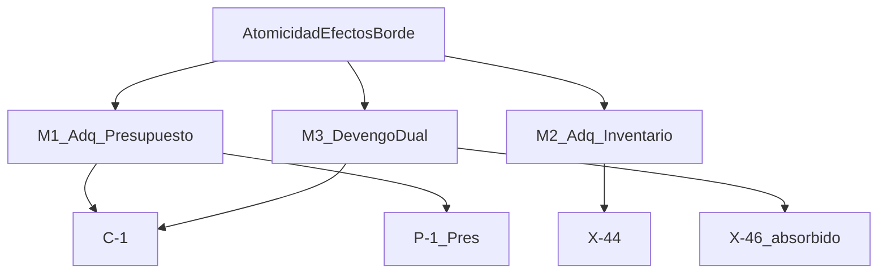
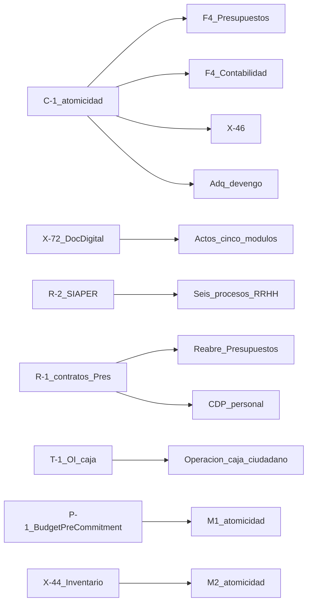

# Plan de trabajo general — Corpus SGM

**Proyecto:** SGM — Sistema de Gestión Municipal  
**Versión:** 0.2 (borrador para revisión interna)  
**Fecha:** julio 2026  
**Estado:** consolidación B0 — no validado con DM

**Mantención:** dueño = equipo de arquitectura SGM (SUBDERE). Se actualiza en cada cierre de bloque (B0/B1/B2) y ante cualquier cambio transversal que afecte a más de un módulo o al grafo de pendientes. Los planes de módulo no alteran este documento por su cuenta: proponen el cambio y el dueño lo incorpora.

**Cambios v0.2:** default **X-44 → (a)** (acoplamiento normativo proceso 28); aclaración mapa seguridad X-21…X-31 vs X-32; **X-80** nace cerrado (RRHH D-1); declaración de mantención; nota de verificación «Corregido» = editado en archivo.

**Cambios v0.1:** primera versión. Consolida deuda de consistencia entre módulos, declara decisiones transversales, unifica pendientes con prefijo **X-nn**, define secuencia B0–B2 y grafo de dependencias cruzadas.

---

## 1. Propósito y alcance

Este documento **gobierna el conjunto** del corpus de planificación y especificación SGM: ordena los planes de módulo, mantiene su consistencia y hace visible el grafo de dependencias que ningún plan individual puede dar.

| Gobierna | No reemplaza |
|---|---|
| Deuda de consistencia entre documentos | Planes de trabajo por módulo (Pres, Cont, Tes, RRHH) |
| Decisiones y patrones transversales (una sola vez) | Especificación ya construida de Adquisiciones |
| Registro unificado de pendientes y grafo cruzado | ADRs de detalle (los referencia) |
| Secuencia B0–B2 hasta bases de licitación | Cronograma con fechas (no aplica; ver §6) |
| Criterios de calidad comunes | Decisiones de jefatura (custodia, alcance licitación): solo registra opciones |

**Regla:** si algo se eleva aquí o a un ADR transversal, se elimina la prosa duplicada en los módulos y se reemplaza por referencia. Duplicar es lo que produjo la deriva.

---

## 2. Estado del corpus

| Documento | Versión | Cobertura levantamiento | Pendientes abiertos (aprox.) | Estado |
|---|---|---|---|---|
| **Adquisiciones** (spec; sin plan de trabajo) | Spec operativa + [`comparativa-odoo-vs-nuevo.md`](modulos/adquisiciones/comparativa-odoo-vs-nuevo.md) | Modalidades parciales; transversales avanzados | Serie X (ex P-32…P-71 en registro) + **A-1…A-5** + deuda §3 | Spec de referencia; deuda de consistencia abierta |
| **Presupuestos** [`plan-de-trabajo.md`](modulos/presupuestos/plan-de-trabajo.md) | 0.11 | ~35–40 % (proc. 26–27) | P-1…P-20 (serie propia) | Borrador; no validado DM |
| **Contabilidad** [`plan-de-trabajo-contabilidad.md`](modulos/contabilidad/plan-de-trabajo-contabilidad.md) | 0.6 | 10 procesos; sustancial | C-1…C-18 | Borrador; no validado DM |
| **Tesorería** [`plan-de-trabajo-tesoreria.md`](modulos/tesoreria/plan-de-trabajo-tesoreria.md) | 0.3 | 5 procesos; ciclo diario fuerte | T-1…T-14 | Borrador; no validado DM |
| **RRHH** [`plan-de-trabajo-rrhh.md`](modulos/rrhh/plan-de-trabajo-rrhh.md) | 0.3 | 18 procesos; mejor del corpus | R-1…R-14 | Borrador; no validado DM |
| **Alcance mínimo módulos adyacentes** | — | — | X-78, X-79, X-81 reservados abiertos al incorporar; **X-80 cerrado** (RRHH D-1: motor de liquidación incluido) | **Ausente del repo** al cerrar v0.1; ubicación destino: [`arquitectura/licitacion/alcance-minimo-modulos-adyacentes.md`](arquitectura/licitacion/alcance-minimo-modulos-adyacentes.md). No inventar contenido. |
| ADR DocDigital | Aceptada (cond. X-72) | — | X-72…X-76 | Canónica |
| ADR Eliminación Odoo | Aceptada | — | — | Canónica |
| ADR Ventana de mutabilidad | Aceptada | — | — | Canónica |
| ADR Atomicidad efectos de borde | Aceptada como problema; mecanismo = C-1 | — | C-1 | Canónica |
| Patrones transversales corpus | Aceptada | — | — | Canónica |
| Registro pendientes arquitectura | — | — | X-01…X-76 (+ X-77; reservas X-78…X-85) | Prefijo **X-nn** |
| Musts / API / Seguridad / Principios | Borrador | — | Ver registro X | Borrador |

---

## 3. Deuda de consistencia

Cada ítem verificado contra el estado del repo en julio 2026. Acción concreta, documento afectado y estado.

**Convención de estado «Corregido»:** significa que el texto del documento afectado **fue editado** (no solo anotado aquí). Verificado en v0.2 contra el contenido vigente de Presupuestos v0.11 (D-1, §6 RRHH bidireccional) y Contabilidad v0.6 (dos conciliaciones en hallazgo 3 / D-2 / §6).

### 3.0 Problema canónico: atomicidad de efectos de borde

**Un solo problema, tres manifestaciones** — no tres pendientes sueltos. Decisión: [`arquitectura/decisiones/2026-07-atomicidad-efectos-borde.md`](arquitectura/decisiones/2026-07-atomicidad-efectos-borde.md). Ancla operativa: **C-1**.

| Manifestación | Acción | Estado |
|---|---|---|
| **M1** Adq→Presupuesto (antes mismo commit ORM) | Vincular P-1 y contratos Adq a ADR atomicidad | Abierto vía P-1 / C-1 |
| **M2** Adq→Inventario/AF | Alta del bien al devengar la factura (Normativa Contabilidad General / proceso 28). Default de alcance en licitación = **(a)** dentro del núcleo Contabilidad — ver §8. Si jefatura eligiera (b), exige mecanismo de compensación escrito (misma familia que C-1) | Abierto (alcance X-44; default (a)) |
| **M3** Devengo dual + momento del devengo | C-1 abierto; **X-46 absorbido bajo C-1** | Abierto (C-1) |

### 3.1 Tabla de deuda

| ID | Origen | Hallazgo verificado | Acción | Documento(s) | Estado |
|---|---|---|---|---|---|
| DC-1 | RRHH R-1 | Disponibilidad presupuestaria bloqueante en 5 procesos; Presupuestos solo tenía RRHH como proveedor 42%/20% | Agregar contrato bidireccional; CDP de personal en alcance | Presupuestos §6, D-1/MP-3; RRHH | **Corregido en v0.11 Pres / v0.3 RRHH** |
| DC-2 | RRHH 3.2.4 | CDP también para gasto en personal (cometidos) | Extender CDP más allá de Adq; revisar `previewBudgetAvailability` | Presupuestos; Adq `contracts.md` | **Corregido (nota de contrato)** |
| DC-3 | Contabilidad C-1 | Devengo dual matiza D-1 de Presupuestos | D-1 Pres: dueño hasta *devengo presupuestario*; patrimonial = Cont; atomicidad = ADR | Presupuestos D-1 | **Corregido en v0.11** |
| DC-4 | Tesorería hallazgo 1 | Dos conciliaciones: auxiliar diaria Tes + contable mensual Cont | Retro-aplicar en Contabilidad proceso 37 / C-10 | Contabilidad | **Corregido en v0.6** |
| DC-5 | RRHH proceso 18 / R-7 | Subsidios COMPIN/Isapre = ciclo de ingresos | Remisión a R-7; pendientes espejo sin cerrar R-7 | Contabilidad, Tesorería | **Registrado (espejo)** |
| DC-6 | DocDigital | ADR a mitad del corpus | Retro-aplicar; IDs → X-72…X-76 | Pres/Cont/Tes/RRHH ya OK; **Adq pendiente de cableado en fichas** | **Parcial** — inventario §3 DocDigital incluye Adq; fichas Adq aún C9 en varios actos |
| DC-7 | Adq X-44 vs Cont D-2 | Cont D-2 incluye inventario/AF; proceso 28 exige alta al devengar factura | Reformular: default **(a)** núcleo Contabilidad; (b) solo con compensación M2 | Contabilidad D-2; X-44; plan general §8 | **Reformulado; default (a); no cerrado** (jefatura) |
| DC-8 | Adq X-46 | Momento del devengo | Absorbedo por problema canónico / C-1 | Registro X-46; recepción 4.4 | **Absorbido** |
| DC-9 | Adq X-47 | Frontera Pago/Tesorería | **Cerrar** citando plan Tesorería: Pago pertenece a Tesorería; etapa 5 Adq = orquestación/contrato | Registro; recepción 4.4; comparativa | **Cerrado** |
| DC-10 | Adq §5 | Cinco decisiones humanas sin ID | Registrar **A-1…A-5** | Plan general §5; comparativa | **Registrado** |
| DC-11 | Prefijos P-nn | Colisión Pres ↔ arquitectura (y P-32 Anexo A; nodo P-71…P-74) | Prefijo transversal **X-nn**; Pres conserva P-nn | Todo el corpus | **Hecho en B0** |

---

## 4. Decisiones transversales

Viven **una sola vez**. Los módulos referencian.

| Decisión | Documento canónico | Contenido breve |
|---|---|---|
| DocDigital | [`2026-07-docdigital-tramitacion-documental.md`](arquitectura/decisiones/2026-07-docdigital-tramitacion-documental.md) | SGM origina; DocDigital tramita; folio = `ExternalFolio`; cond. **X-72** |
| Ventana de mutabilidad | [`2026-07-ventana-mutabilidad.md`](arquitectura/decisiones/2026-07-ventana-mutabilidad.md) | Apertura / cierre / reapertura auditada / bloqueo fuera de ventana |
| Atomicidad efectos de borde | [`2026-07-atomicidad-efectos-borde.md`](arquitectura/decisiones/2026-07-atomicidad-efectos-borde.md) | Un problema, tres manifestaciones; ancla **C-1** |
| Patrones de diagnóstico y método | [`2026-07-patrones-transversales-corpus.md`](arquitectura/decisiones/2026-07-patrones-transversales-corpus.md) | Expediente sin efecto; citas en fuente primaria; plazos legales; gates; integraciones Estado |
| Eliminación Odoo | [`2026-07-eliminacion-odoo.md`](arquitectura/decisiones/2026-07-eliminacion-odoo.md) | Licitar desde cero; API-first |

---

## 5. Registro unificado de pendientes

### 5.1 Convención de prefijos

| Prefijo | Ámbito |
|---|---|
| **X-nn** | Transversal (ex P-nn de arquitectura, seguridad, Adq en registro, DocDigital) |
| **P-nn** | Solo módulo **Presupuestos** |
| **C-nn** | Contabilidad |
| **T-nn** | Tesorería |
| **R-nn** | RRHH |
| **A-nn** | Decisiones humanas Adquisiciones (comparativa §5) aún sin ID en registro viejo |

Registro detallado X-01…X-76: [`arquitectura/decisiones/pendientes.md`](arquitectura/decisiones/pendientes.md).

### 5.2 Mapa de renumeración y colisiones resueltas

| Antes | Después | Nota |
|---|---|---|
| Arquitectura P-01…P-76 | **X-01…X-76** | 1:1 en el registro |
| Seguridad P-21…**P-31** (registro) | **X-21…X-31** | Serie de seguridad; **no incluye X-32** |
| P-32 del registro (resiliencia MP / APIs externas) | **X-32** | Origen Adquisiciones (también citado históricamente desde seguridad §14); **no** es “completar Anexo A” |
| Seguridad Anexo A «P-32» (completar hallazgos Odoo) | **X-77** | Colisión semántica histórica con X-32; ID propio |
| Nodo SUBDERE «P-71…P-74» (propuestos, no en registro) | **X-82…X-85** | No pisar X-71…X-74 (Trato Directo / DocDigital) |
| Alcance mínimo P-18, P-19, P-21 | **X-78, X-79, X-81** reservados (abiertos al incorporar) | Documento aún no en repo; no inventar texto |
| Alcance mínimo P-20 (motor de liquidación) | **X-80** — **cerrado** | Ya cerrado por RRHH D-1; al incorporar el alcance mínimo entra con ese fundamento, no como abierto |
| Presupuestos P-1…P-20 | **Sin cambio** | Sus refs a DocDigital apuntan a X-73…X-76 |

### 5.3 Pendientes Adquisiciones A-1…A-5

| ID | Descripción | Origen | Estado |
|---|---|---|---|
| **A-1** | Clasificador rubro / categoría de ítem (ONU-SPSC / presupuestario / ambos) | Comparativa §5; analitica §9.5 | Abierto |
| **A-2** | Flag activo fijo temprano: ¿en SOLPED/OC o solo en 4.3 por umbral? | Comparativa §5 | Abierto |
| **A-3** | Distribución presupuestaria multi-línea: ¿solo en Presupuestos detrás de `budget_line_id`? | Comparativa §5 | Abierto |
| **A-4** | Orden de ingreso de bodega: ¿campo Adq o proveedor de inventario? | Comparativa §5 | Abierto |
| **A-5** | Recompra: ¿entidad explícita o solo republicación/desierto? | Comparativa §5 | Abierto |

### 5.4 Cierres y absorciones por cruce (B0)

| ID | Resultado | Fundamento |
|---|---|---|
| **X-47** (ex P-47) | **Cerrado** | Plan de Tesorería: el pago es de Tesorería; etapa 5 de Adq orquesta vía contrato. No hay ambigüedad de dueño de módulo. |
| **X-46** (ex P-46) | **Absorbido bajo C-1** | Mismo problema canónico (M3); no se resuelve aparte |
| **X-44** (ex P-44) | **Reformulado, abierto** | Contradicción aparente con Contabilidad D-2; default provisional **(a)** — ver §8 |

### 5.5 Grafo de dependencias cruzadas

Pendientes que bloquean a **más de un módulo** o reabren otro:

| Pendiente | Bloquea | Responsable típico |
|---|---|---|
| **C-1** | F4 Pres y Cont; X-46; momento Accrual Adq | Arquitectura + DM |
| **X-72** | Actos administrativos en todos los módulos + Adq | Gobierno Digital / equipo |
| **R-2** | MR-6 y ≥6 procesos RRHH | CGR / equipo |
| **R-1** | Reabre Pres; CDP personal; borde Adq | Equipo + Pres + RRHH |
| **T-1** | F3 Tes; cara al ciudadano | Equipo + DM |
| **P-1** | F0/F4 Pres; M1 | Equipo + Adq |
| **X-44** | M2; bases licitación | Jefatura |

**Índice compacto de abiertos por módulo** (detalle en cada plan / registro X):

| Serie | Abiertos relevantes |
|---|---|
| Presupuestos | P-1, P-3…P-8, P-10…P-20 |
| Contabilidad | C-1…C-18 |
| Tesorería | T-1…T-14 (T-3 elevación ventana **cumplida**; residual doble raíz) |
| RRHH | R-1…R-14 |
| Adquisiciones | A-1…A-5; X-32…X-45, X-48…; X-44 reformulado; X-46 absorbido; X-47 cerrado |
| Transversal | X-01…X-76 (salvo cerrados); X-77; X-78…X-81 reservados alcance mínimo; X-82…X-85 nodo |

---

## 6. Secuencia de trabajo

No es waterfall: los transversales se declaran en B0 porque **ya se aprendieron**. Sin fechas: varias tareas dependen de terceros.

| Bloque | Contenido | Criterio de salida |
|---|---|---|
| **B0 — Consolidación** | Este documento; deuda §3; ADRs §4; renumeración X-nn; retrofit módulos | Ningún módulo contradice a otro; decisión transversal una sola vez |
| **B1 — Verificaciones bloqueantes** | DocDigital M2M (**X-72**), SIAPER (**R-2**), corpus NICSP 2020, formatos CGR/SINIM/DIPRES, Manual Imputaciones V21 | Ninguna especificación condicionada a verificación pendiente |
| **B2 — Detalle por módulo** | Fases F1–F5 de cada plan, ordenadas por el grafo | Cada módulo cumple sus criterios de término |

### Orden de ejecución B2 (fundado en el grafo)

1. **Problema canónico (C-1) + frontera Pres↔Cont↔Adq** — F0 compartido; desbloquea F4 de dos módulos y X-46.
2. **Presupuestos F1–F3** — CDP ampliado y contrato RRHH (R-1); paralelizable con B1 no bloqueantes.
3. **Contabilidad F1–F3** — tras matiz D-1 y dos conciliaciones.
4. **Tesorería** — priorizar **T-1** (caja / cara ciudadano); frontera Cont solapable.
5. **RRHH** — F0 tras R-1 reflejado en Pres; F1 largo; **R-2** en B1.
6. **Adquisiciones** — solo retrofit de deuda (§3); no hay F1–F5 de plan.

---

## 7. Criterios de calidad comunes

Viven **una sola vez** aquí. Los planes de módulo referencian esta sección (o el ADR de patrones) en lugar de reiterar.

1. **Estándar de especificación:** dos equipos independientes construyen sistemas equivalentes solo con la especificación.
2. **Método:** fichas → entidades EN → contratos API → wireframes → transversales (método Adquisiciones).
3. **Odoo = requisitos candidatos, nunca arquitectura;** contrastar ORM, no export BD.
4. **Validadores bloqueantes con `legal_reference`** ([`musts-arquitectura.md`](arquitectura/especificacion/musts-arquitectura.md) §11).
5. **Parámetros con vigencia temporal y clase de autoridad** (`NormativeParameter`; mandato propio vs órgano rector).
6. **Contratos versionados** entre módulos, con clasificación síncrona / asíncrona / cacheada.
7. **Cobertura que exige efecto de dominio** — lente «expediente sin efecto» ([patrones](arquitectura/decisiones/2026-07-patrones-transversales-corpus.md) §1).
8. **Citas del levantamiento verificadas en fuente primaria** (patrones §2) — entregable F1.
9. **Plazos legales computables** con registro (patrones §3).
10. **SoD impuesto por el motor**, no solo por procedimiento.
11. **Núcleo no diferible** marcado con condición de salida por diferimiento.
12. **DocDigital / integraciones:** no asumir M2M sin verificación (X-72, R-2).

---

## 8. Ruta a las bases de licitación

| Va a las bases (exigencia al adjudicatario) | Obligación de SUBDERE (no se “licita” como producto) |
|---|---|
| Cumplir OpenAPI / contratos versionados / musts verificables | Track GP (vigilancia normativa, parámetros, versionado de contratos) |
| Implementar ventanas de mutabilidad y SoD en motor | Custodia / hospedaje según modo (decisión de jefatura pendiente) |
| Cablear integraciones según contrato funcional (DocDigital, SIAPER, MP, …) | Verificaciones B1 ante terceros (Gobierno Digital, CGR, …) |
| Entregar evidencia de `legal_reference`, auditoría, pentest | Redacción de bases; consulta al mercado (X-18, X-19) |
| Respetar independencia modular y mecanismo de atomicidad que fije C-1 | Decisión alcance Inventario/AF (**X-44**) y profundidad por módulo |

### Decisiones de jefatura (no resueltas aquí)

| Tema | Opciones | Default provisional |
|---|---|---|
| **X-44** Inventario / Activo fijo en licitación | (a) Incluir en Contabilidad/núcleo; (b) módulo futuro + adaptador **con mecanismo de compensación escrito** (familia C-1 / M2); (c) solo contrato de borde (insuficiente solo) | **(a)** — el proceso 28 exige registrar el bien **al devengar la factura**, fundado en la Normativa de Contabilidad General de la Nación (Contabilidad §4). Elegir (b) sin compensación deja el efecto de M2 fuera del sistema y contradice §3.0. Jefatura puede pasar a (b) solo si documenta la compensación. |
| Modelo de custodia / hospedaje | Modos ya en principios / macro-stack | Sin cambio en B0 |
| Track GP en bases (Pres P-13) | Declarar obligación SUBDERE vs exigir soporte técnico al adjudicatario | Soporte técnico en bases; operación GP = SUBDERE |

**Cerrado antes de publicar bases:** B0 completo; B1 en lo que condicione protocolo (al menos postura documentada post-X-72/R-2); C-1 con mecanismo escrito; X-44 decidido por jefatura; núcleo no diferible por módulo.

---

## 9. Riesgos del programa

| Riesgo | Por qué es de conjunto | Mitigación |
|---|---|---|
| Dependencia de terceros en B1 (DocDigital, SIAPER, formatos CGR/DIPRES) | Bloquea diseño de protocolo en *todos* los módulos con actos o reportes | Contrato funcional sin endpoints hasta verificar; vía asistida documentada (X-73) |
| Deriva de consistencia si se sigue módulo a módulo sin este documento | Ya ocurrió (R-1, conciliaciones, DocDigital a mitad) | B0 obligatorio; plan general como gate (§1 Mantención: dueño arquitectura; actualización en cierres de bloque y cambios transversales) |
| Capacidad del equipo vs tamaño del corpus | Cuatro planes + spec Adq + transversales + inventarios Odoo | Priorizar grafo §5.5; no abrir F3 de un módulo si su F0 cruzado está abierto |
| Subestimar atomicidad de borde | Tres manifestaciones vistas como pendientes baratos | ADR + C-1 en F0 compartido (§6); default X-44 = (a) |
| Alcance mínimo ausente del repo | RRHH D-1 y Cont F5 citan un documento inexistente aquí | Incorporar archivo; X-78/79/81 reservados; **X-80 entra cerrado** (RRHH D-1) |

---

## Anexo A — Trazabilidad de esta versión

| Afirmación | Fuente |
|---|---|
| R-1 / CDP personal | RRHH plan §3.1 hallazgos 1–2 |
| Devengo dual | Contabilidad D-1, C-1 |
| Dos conciliaciones | Tesorería §3.1 hallazgo 1 |
| Subsidios COMPIN | RRHH R-7, proceso 18 |
| Mismo commit Odoo Pres+Inventario | Adq comparativa §3.3 |
| P-44 / P-46 / P-47 | Adq comparativa §5; pendientes.md; recepción 4.3–4.4 |
| DocDigital | ADR 2026-07-docdigital |
| Ventana mutabilidad | Tesorería T-3; cuatro entidades |
| Colisión P-nn | pendientes.md vs Pres P-1…P-20; seguridad Anexo A; nodo §9 |

---

## Registro de cambios

| Versión | Fecha | Cambio |
|---|---|---|
| 0.2 | julio 2026 | X-44 default (a); mapa X-21…X-31 vs X-32; X-80 cerrado; mantención; verificación «Corregido» |
| 0.1 | julio 2026 | Creación. B0: deuda, ADRs, X-nn, grafo, secuencia B0–B2 |
